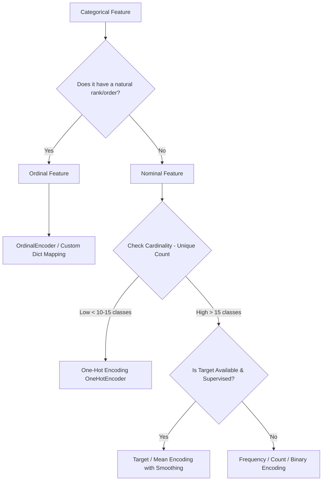

# Class 4: Categorical Encoding & Feature Scaling Mastery

A comprehensive, production-grade guide to transforming raw, non-numeric, and multi-scale tabular data into optimized feature matrices for Machine Learning models.

---

## 📋 Table of Contents
1. [Why Encoding & Scaling Matter](#1-why-encoding--scaling-matter)
2. [Categorical Encoding Taxonomy](#2-categorical-encoding-taxonomy)
   - [Nominal vs. Ordinal Variables](#nominal-vs-ordinal-variables)
   - [1. One-Hot Encoding (OHE) & Dummy Variable Trap](#1-one-hot-encoding-ohe--dummy-variable-trap)
   - [2. Ordinal & Label Encoding](#2-ordinal--label-encoding)
   - [3. Frequency / Count Encoding](#3-frequency--count-encoding)
   - [4. Target / Mean Encoding with Smoothing](#4-target--mean-encoding-with-smoothing)
   - [5. Weight of Evidence (WoE) & Information Value (IV)](#5-weight-of-evidence-woe--information-value-iv)
   - [6. Binary & Hashing Encoding for High Cardinality](#6-binary--hashing-encoding-for-high-cardinality)
3. [Feature Scaling Taxonomy](#3-feature-scaling-taxonomy)
   - [Why Scale Features?](#why-scale-features)
   - [1. Standard Scaler (Z-Score Standardization)](#1-standard-scaler-z-score-standardization)
   - [2. Min-Max Scaler (Normalization)](#2-min-max-scaler-normalization)
   - [3. Robust Scaler (Outlier-Resilient)](#3-robust-scaler-outlier-resilient)
   - [4. MaxAbs Scaler (Sparse Matrices)](#4-maxabs-scaler-sparse-matrices)
   - [5. Power Transformer (Yeo-Johnson & Box-Cox)](#5-power-transformer-yeo-johnson--box-cox)
   - [6. Quantile Transformer](#6-quantile-transformer)
4. [Algorithm Sensitivity Matrix](#4-algorithm-sensitivity-matrix)
5. [The Cardinal Rule: Preventing Data Leakage](#5-the-cardinal-rule-preventing-data-leakage)
6. [End-to-End Pipeline with ColumnTransformer](#6-end-to-end-pipeline-with-columntransformer)
7. [Interview Traps & Best Practices](#7-interview-traps--best-practices)
8. [Practice Exercises & Solutions](#8-practice-exercises--solutions)

---

## 1. Why Encoding & Scaling Matter

Machine learning algorithms are mathematical functions $f(X) \to y$. They operate on numbers, vectors, and matrices:
- **Encoding**: Converts qualitative categorical strings (`"IndiGo"`, `"Delhi"`, `"Economy"`) into numerical representations without introducing false mathematical relationships.
- **Scaling**: Equalizes the magnitude of different continuous features (`Age: [18, 65]` vs. `Salary: [25,000, 300,000]`), preventing distance-based and gradient-based algorithms from being dominated by high-magnitude variables.

```
Raw Tabular Data                Clean Feature Matrix X
┌──────────────────┐            ┌────────────────────────────────┐
│ City    | Salary │   Encode   │ City_Delhi | City_Mumbai | Salary_Std │
├──────────────────┤   ──────►  ├────────────────────────────────┤
│ Delhi   | 80,000 │   & Scale  │     1      |      0      |    0.42    │
│ Mumbai  | 120,000│            │     0      |      1      |    1.18    │
└──────────────────┘            └────────────────────────────────┘
```

---

## 2. Categorical Encoding Taxonomy



### Nominal vs. Ordinal Variables
- **Nominal Variables**: Categories have **no intrinsic order or hierarchy**. (e.g., `Airline`: IndiGo, Air India, SpiceJet; `State`: California, Texas, Florida).
- **Ordinal Variables**: Categories have a **strict logical order**. (e.g., `Total_Stops`: non-stop < 1 stop < 2 stops; `Education`: High School < Bachelor < Master < PhD; `Customer Rating`: Poor < Average < Good < Excellent).

---

### 1. One-Hot Encoding (OHE) & Dummy Variable Trap

#### How It Works:
Creates a separate binary ($0$ or $1$) indicator column for each distinct category.

#### The Dummy Variable Trap (Multicollinearity):
If a variable has $K$ categories and you create $K$ binary columns, the sum of those columns will always equal $1$:
$$x_1 + x_2 + \dots + x_K = 1$$
This creates **perfect multicollinearity** ($\text{rank}(X) < p$), causing $(X^T X)^{-1}$ to become non-invertible in Ordinary Least Squares (OLS) Linear Regression.
* **Solution**: Set `drop='first'`, which creates $K-1$ columns. If all $K-1$ columns are $0$, the sample belongs to the dropped baseline category.

```python
import pandas as pd
from sklearn.preprocessing import OneHotEncoder

df = pd.DataFrame({
    'Airline': ['IndiGo', 'Air India', 'Jet Airways', 'IndiGo', 'SpiceJet']
})

# drop='first' avoids multicollinearity for Linear/Logistic models
ohe = OneHotEncoder(drop='first', sparse_output=False, handle_unknown='ignore')
encoded_array = ohe.fit_transform(df[['Airline']])

encoded_df = pd.DataFrame(encoded_array, columns=ohe.get_feature_names_out(['Airline']))
print(encoded_df)
```

> **When to use**: Nominal features with low cardinality ($< 10–15$ categories).
> **When NOT to use**: High cardinality features (e.g., `ZipCode` with 10,000 unique values), as it causes massive dimensional explosion and sparse memory consumption.

---

### 2. Ordinal & Label Encoding

#### How It Works:
Assigns sequential integers ($0, 1, 2, 3, \dots$) to categories reflecting their natural order.

#### ⚠️ Warning: LabelEncoder vs. OrdinalEncoder
- `LabelEncoder`: Designed **ONLY** for encoding the 1D target vector $y$ (`y_train`).
- `OrdinalEncoder`: Designed for 2D input feature matrices $X$ (`X_train`).

```python
import pandas as pd
from sklearn.preprocessing import OrdinalEncoder

# Scenario 1: Custom explicit dictionary mapping (Best Practice)
df = pd.DataFrame({'Total_Stops': ['non-stop', '2 stops', '1 stop', 'non-stop', '3 stops']})

stops_mapping = {
    'non-stop': 0,
    '1 stop': 1,
    '2 stops': 2,
    '3 stops': 3,
    '4 stops': 4
}
df['Total_Stops_Mapped'] = df['Total_Stops'].map(stops_mapping)

# Scenario 2: Scikit-Learn OrdinalEncoder with predefined rank order
education_ranking = [['High School', 'Bachelors', 'Masters', 'PhD']]
ordinal_encoder = OrdinalEncoder(categories=education_ranking, handle_unknown='use_encoded_value', unknown_value=-1)
```

---

### 3. Frequency / Count Encoding

#### How It Works:
Replaces each category with its frequency count or normalized proportion within the training dataset.

$$\text{Encoded}(c) = \frac{\text{Count of Category } c}{\text{Total Rows } N}$$

```python
import pandas as pd

df = pd.DataFrame({
    'City': ['Delhi', 'Mumbai', 'Delhi', 'Delhi', 'Bangalore', 'Mumbai']
})

freq_map = df['City'].value_counts(normalize=True).to_dict()
df['City_Freq'] = df['City'].map(freq_map)
print(df)
```

> **Advantage**: Keeps dimension fixed to 1 column. High-frequency categories are distinguished from rare categories.
> **Disadvantage**: Two different categories with the same frequency receive identical encoded values (collision).

---

### 4. Target / Mean Encoding with Smoothing

#### How It Works:
Replaces each category with the average target value ($\bar{y}$) for that category. It directly captures the relationship between the categorical feature and the target variable.

#### The Problem: Severe Target Leakage & Overfitting
If a category `"SuperJet"` appears only once in the entire dataset with target `Price = 50,000`, a naive target encoding sets `SuperJet = 50,000`. The model simply memorizes this value, resulting in 100% training accuracy but massive failure on unseen data.

#### The Solution: $m$-Estimate Smoothing & Cross-Fitting
Smooth the category mean with the global dataset mean using a weight parameter $m$:

$$\hat{S}_c = \frac{n_c \cdot \bar{y}_c + m \cdot \bar{y}_{\text{global}}}{n_c + m}$$

Where:
- $n_c$: Number of training samples in category $c$.
- $\bar{y}_c$: Mean target value for category $c$.
- $\bar{y}_{\text{global}}$: Overall mean target across all training samples.
- $m$: Smoothing weight (higher $m$ gives more weight to the global mean for rare categories).

```python
from sklearn.preprocessing import TargetEncoder
import pandas as pd
from sklearn.model_selection import train_test_split

X = pd.DataFrame({'Airline': ['IndiGo', 'Air India', 'IndiGo', 'Jet Airways', 'IndiGo', 'SpiceJet']})
y = pd.Series([4000, 8000, 4200, 14000, 3900, 3500])

X_train, X_test, y_train, y_test = train_test_split(X, y, test_size=0.33, random_state=42)

# Scikit-Learn's built-in TargetEncoder applies automatic smoothing and K-Fold cross-fitting
target_encoder = TargetEncoder(smooth="auto", cv=5)
X_train_encoded = target_encoder.fit_transform(X_train, y_train)
X_test_encoded = target_encoder.transform(X_test)
```

---

### 5. Weight of Evidence (WoE) & Information Value (IV)

Widely used in **Credit Scoring, Banking, and Risk Modeling** for binary classification ($y \in \{0, 1\}$).

#### Mathematical Formula:
$$\text{WoE}_c = \ln \left( \frac{\% \text{ of Non-Events (Goods) in category } c}{\% \text{ of Events (Bads) in category } c} \right) = \ln \left( \frac{N_{c, 0} / N_{\text{total}, 0}}{N_{c, 1} / N_{\text{total}, 1}} \right)$$

* $\text{WoE} > 0$: Category has higher concentration of Good customers.
* $\text{WoE} < 0$: Category has higher concentration of Bad / Default customers.

---

### 6. Binary & Hashing Encoding for High Cardinality

When a nominal column has $1,000+$ categories (e.g., `Product_ID`, `IP_Address`), One-Hot creates 1,000 columns.

* **Binary Encoding**: Converts categories to integers, then transforms integers into binary bits ($0$ and $1$). $1,024$ unique categories can be represented in only $\log_2(1024) = 10$ columns!
* **Feature Hashing (Hashing Trick)**: Uses a hash function (e.g., MurmurHash3) to project arbitrary strings into a fixed-size vector space (`sklearn.feature_extraction.FeatureHasher`).

```python
# Using category_encoders package
# pip install category_encoders
import category_encoders as ce

binary_encoder = ce.BinaryEncoder(cols=['High_Cardinality_Col'])
df_binary = binary_encoder.fit_transform(df)
```

---

## 3. Feature Scaling Taxonomy

```
                       Continuous Feature Distribution
                                      │
            ┌─────────────────────────┼─────────────────────────┐
            ▼                         ▼                         ▼
   Gaussian / Normal        Bounded / Neural Nets      Heavy Outliers Present
            │                         │                         │
      StandardScaler             MinMaxScaler              RobustScaler
     (μ = 0,  σ = 1)               ([0, 1])            (Median & IQR Range)
```

---

### 1. Standard Scaler (Z-Score Standardization)
Centers features around $0$ with a standard deviation of $1$.

$$z = \frac{x - \mu}{\sigma}$$

* **Assumptions**: Best when features are approximately normally distributed.
* **Sensitivity to Outliers**: **High**. Outliers pull the mean $\mu$ and inflate the standard deviation $\sigma$.

```python
from sklearn.preprocessing import StandardScaler
scaler = StandardScaler()
X_train_scaled = scaler.fit_transform(X_train)
X_test_scaled = scaler.transform(X_test)
```

---

### 2. Min-Max Scaler (Normalization)
Rescales all feature values strictly into a specified interval (default $[0, 1]$).

$$x_{\text{scaled}} = \frac{x - x_{\text{min}}}{x_{\text{max}} - x_{\text{min}}}$$

* **When to use**: Image pixel intensities ($[0, 255] \to [0, 1]$), distance-based models where hard boundaries are needed ($k$-NN).
* **Sensitivity to Outliers**: **Extreme**. A single extreme outlier compresses all normal data points into a tiny cluster near $0$.

```python
from sklearn.preprocessing import MinMaxScaler
scaler = MinMaxScaler(feature_range=(0, 1))
```

---

### 3. Robust Scaler (Outlier-Resilient)
Removes the median and scales the data according to the Interquartile Range ($\text{IQR} = Q_3 - Q_1$).

$$x_{\text{scaled}} = \frac{x - \text{Median}(X)}{Q_3(X) - Q_1(X)}$$

* **When to use**: Financial income, transaction amounts, housing prices with significant extreme outliers.
* **Sensitivity to Outliers**: **Zero to Minimal**. Median and IQR are unaffected by extreme values.

```python
from sklearn.preprocessing import RobustScaler
scaler = RobustScaler()
```

---

### 4. MaxAbs Scaler (Sparse Matrices)
Scales each feature by its maximum absolute value without shifting the center:

$$x_{\text{scaled}} = \frac{x}{\max(|x|)}$$

* **Key Advantage**: Does not subtract the mean, preserving **matrix sparsity** (zeros remain zeros). Essential for large sparse TF-IDF or One-Hot encoded matrices.

---

### 5. Power Transformer (Yeo-Johnson & Box-Cox)
Applies a parametric power transformation to stabilize variance and transform heavily skewed, non-normal distributions into Gaussian-like bell curves.

- **Box-Cox**: Requires strictly positive values ($x > 0$).
- **Yeo-Johnson**: Works with both positive, zero, and negative values.

```python
from sklearn.preprocessing import PowerTransformer
pt = PowerTransformer(method='yeo-johnson')
X_gaussian = pt.fit_transform(X_train[['Skewed_Feature']])
```

---

### 6. Quantile Transformer
Maps data to a uniform or normal distribution based on ranking quantiles. Completely eliminates the impact of extreme outliers by smoothing out non-linear relationships.

```python
from sklearn.preprocessing import QuantileTransformer
qt = QuantileTransformer(output_distribution='normal', random_state=42)
```

---

## 4. Algorithm Sensitivity Matrix

| Algorithm | Needs Scaling? | Sensitive to Outliers? | Needs Categorical Encoding? |
| :--- | :---: | :---: | :---: |
| **Linear Regression (OLS)** | ⚠️ Recommended (for stability) | Yes | Yes (OHE with `drop='first'`) |
| **Ridge / Lasso Regression** | **YES (MANDATORY)** | Yes | Yes |
| **Logistic Regression** | **YES (MANDATORY)** | Yes | Yes |
| **$k$-Nearest Neighbors ($k$-NN)** | **YES (MANDATORY)** | Extremely | Yes |
| **Support Vector Machines (SVM / SVR)** | **YES (MANDATORY)** | High | Yes |
| **Principal Component Analysis (PCA)** | **YES (MANDATORY)** | High | Yes |
| **$K$-Means Clustering** | **YES (MANDATORY)** | High | Yes |
| **Decision Trees (CART)** | **NO** (Scale Invariant) | Immune | Yes |
| **Random Forests / Extra Trees** | **NO** (Scale Invariant) | Immune | Yes |
| **XGBoost / LightGBM** | **NO** (Scale Invariant) | Immune | Yes |
| **CatBoost** | **NO** (Scale Invariant) | Immune | **Native support for categoricals** |

---

## 5. The Cardinal Rule: Preventing Data Leakage

```
                          Original Raw Dataset
                                   │
               ┌───────────────────┴───────────────────┐
               ▼                                       ▼
        Train Set (80%)                         Test Set (20%)
               │                                       │
     fit_transform(X_train)                    transform(X_test)
 (Learns μ, σ, medians, categories)        (Applies learned parameters)
```

### 🚫 The Severe Mistake:
```python
# ❌ INCORRECT: Data Leakage!
scaler = StandardScaler()
X_scaled = scaler.fit_transform(X) # Learned mean & std of test data!
X_train, X_test, y_train, y_test = train_test_split(X_scaled, y)
```

### ✅ The Correct Workflow:
```python
# ✅ CORRECT: Zero Data Leakage
X_train, X_test, y_train, y_test = train_test_split(X, y, test_size=0.2, random_state=42)

scaler = StandardScaler()
X_train_scaled = scaler.fit_transform(X_train) # Computes mean & std of train only
X_test_scaled = scaler.transform(X_test)       # Reuses train mean & std on test
```

---

## 6. End-to-End Pipeline with ColumnTransformer

Here is the clean, industry-standard pattern combining categorical encoding and numerical scaling inside a single Scikit-Learn `Pipeline`.

```python
import pandas as pd
import numpy as np
from sklearn.model_selection import train_test_split
from sklearn.compose import ColumnTransformer
from sklearn.pipeline import Pipeline
from sklearn.impute import SimpleImputer
from sklearn.preprocessing import OneHotEncoder, RobustScaler, StandardScaler
from sklearn.linear_model import Ridge
from sklearn.metrics import root_mean_squared_error, r2_score

# 1. Load Dataset (Flight Prices Example)
data = {
    'Airline': ['IndiGo', 'Air India', 'Jet Airways', 'IndiGo', 'SpiceJet', 'IndiGo', 'Jet Airways', 'Air India'],
    'Source': ['Banglore', 'Kolkata', 'Delhi', 'Banglore', 'Chennai', 'Delhi', 'Kolkata', 'Delhi'],
    'Total_Stops': [0, 2, 2, 1, 0, 1, 2, 1],
    'Duration_Mins': [170, 445, 1140, 325, 130, 210, 890, 410],
    'Price': [3897, 7662, 13882, 6218, 3500, 5100, 12500, 8200]
}
df = pd.DataFrame(data)

X = df.drop(columns=['Price'])
y = df['Price']

# 2. Train-Test Split (BEFORE any preprocessing)
X_train, X_test, y_train, y_test = train_test_split(X, y, test_size=0.25, random_state=42)

# 3. Define Feature Subsets
categorical_features = ['Airline', 'Source']
numerical_features = ['Total_Stops', 'Duration_Mins']

# 4. Build Sub-Pipelines for each data type
categorical_transformer = Pipeline(steps=[
    ('imputer', SimpleImputer(strategy='most_frequent')),
    ('encoder', OneHotEncoder(drop='first', handle_unknown='ignore', sparse_output=False))
])

numerical_transformer = Pipeline(steps=[
    ('imputer', SimpleImputer(strategy='median')),
    ('scaler', RobustScaler())
])

# 5. Assemble Full ColumnTransformer
preprocessor = ColumnTransformer(
    transformers=[
        ('cat', categorical_transformer, categorical_features),
        ('num', numerical_transformer, numerical_features)
    ],
    remainder='drop'
)

# 6. Build Final Production Model Pipeline
model_pipeline = Pipeline(steps=[
    ('preprocessor', preprocessor),
    ('regressor', Ridge(alpha=1.0))
])

# 7. Fit Pipeline on Training Data
model_pipeline.fit(X_train, y_train)

# 8. Predict and Evaluate on Unseen Test Data
y_pred = model_pipeline.predict(X_test)

print(f"R² Score: {r2_score(y_test, y_pred):.4f}")
print(f"Test Predictions: {y_pred.round(2)}")
```

---

## 7. Interview Traps & Best Practices

1. **Q: Why must you scale features before applying L1 (Lasso) or L2 (Ridge) Regularization?**
   * *Answer*: Regularization adds a penalty proportional to the magnitude of the coefficients ($\lambda \sum |w_j|$ or $\lambda \sum w_j^2$). If features are on different scales, features with naturally large numerical ranges will have tiny coefficients and avoid penalty, while small-range features will have large coefficients and be penalized excessively.
2. **Q: Why do Tree-based algorithms (Decision Trees, Random Forest, XGBoost) NOT require feature scaling?**
   * *Answer*: Decision trees make orthogonal splits based on ordering inequalities ($x_j \le \theta$). Monotonic transformations (such as scaling or shifting) preserve the rank order of values, so the exact same split point is chosen regardless of scale.
3. **Q: How do you handle unseen categories during inference with `OneHotEncoder`?**
   * *Answer*: Set `handle_unknown='ignore'`. During `.transform()`, any new category not seen in the training data will have all its one-hot columns set to zero instead of raising a ValueError.

---

## 8. Practice Exercises & Solutions

### Exercise 1:
You have a column `Customer_Rating` with values `['Poor', 'Average', 'Good', 'Excellent', 'Average']`. Which encoder should you use, and what numbers should you assign?
* **Solution**: `OrdinalEncoder` with mapping: `{'Poor': 0, 'Average': 1, 'Good': 2, 'Excellent': 3}`.

### Exercise 2:
You have a dataset with extreme income outliers ($[10,000 \dots 50,000,000]$). Explain why `RobustScaler` is mathematically superior to `StandardScaler` for this feature.
* **Solution**: `StandardScaler` computes the sample mean $\bar{x} = \frac{1}{n} \sum x_i$ and standard deviation $s = \sqrt{\frac{1}{n-1} \sum (x_i - \bar{x})^2}$. A single $50,000,000$ outlier drags the mean upwards and inflates the standard deviation, crushing $99\%$ of the normal data points into a narrow cluster near $0$. `RobustScaler` uses the **median** ($50^{\text{th}}$ percentile) and **Interquartile Range** ($\text{IQR} = Q_3 - Q_1$), which are non-parametric and unaffected by extreme tail outliers.
