```mermaid
flowchart TD
    subgraph W1 [WEEK 1: Foundations, Cleaning & Feature Engineering]
        D1[Day 1: Applied Math & Statistics for ML] --> D2[Day 2: NumPy & Pandas High-Speed Wrangling]
        D2 --> D3[Day 3: EDA, Missing Data Imputation & Outliers]
        D3 --> D4[Day 4: Categorical Encoding & Feature Scaling]
        D4 --> D5[Day 5: Feature Engineering & Selection]
        D5 --> P1([Weekend 1: Automated Preprocessing Pipeline])
    end

    subgraph W2 [WEEK 2: Core Supervised Learning - Regression & Classification]
        P1 --> D6[Day 6: Linear Regression & Gradient Descent]
        D6 --> D7[Day 7: Regularization: Ridge, Lasso & ElasticNet]
        D7 --> D8[Day 8: Logistic Regression & Probabilistic Modeling]
        D8 --> D9[Day 9: Evaluation Metrics & Imbalanced Data Handling]
        D9 --> D10[Day 10: Decision Trees CART & SVMs]
        D10 --> P2([Weekend 2: Loan Default Risk Benchmark])
    end

    subgraph W3 [WEEK 3: Ensemble Learning Mastery - Bagging, Boosting & Stacking]
        P2 --> D11[Day 11: Ensemble Foundations & Bagging]
        D11 --> D12[Day 12: Random Forests & Extra Trees]
        D12 --> D13[Day 13: Boosting Foundations: AdaBoost & GBDT]
        D13 --> D14[Day 14: Modern SOTA Boosting: XGBoost & LightGBM]
        D14 --> D15[Day 15: CatBoost & Multi-Level Stacking Ensembles]
        D15 --> P3([Weekend 3: Kaggle Tabular Tournament Pipeline])
    end

    subgraph W4 [WEEK 4: Validation, Optuna & Unsupervised Learning]
        P3 --> D16[Day 16: Cross-Validation Schemes & Leakage Prevention]
        D16 --> D17[Day 17: Hyperparameter Optimization with Optuna]
        D17 --> D18[Day 18: Clustering: K-Means, Hierarchical & GMM]
        D18 --> D19[Day 19: DBSCAN & Anomaly Detection: Isolation Forest]
        D19 --> D20[Day 20: Dimensionality Reduction: PCA & UMAP]
        D20 --> P4([Weekend 4: Customer Segmentation & Fraud Engine])
    end

    subgraph W5 [WEEK 5: Advanced ML, Explainability & Production MLOps]
        P4 --> D21[Day 21: Tabular Time Series Forecasting with Lag Features]
        D21 --> D22[Day 22: Explainable AI: SHAP Values & LIME]
        D22 --> D23[Day 23: Recommender Systems: SVD & Collaborative Filtering]
        D23 --> D24[Day 24: Custom Scikit-Learn Transformers & Modular Pipelines]
        D24 --> D25[Day 25: Production MLOps: FastAPI, Streamlit, Docker & Drift]
        D25 --> P5([Final Capstone: Live Production ML Microservice])
    end
```

---

## 📅 Full Day-by-Day Master Flow

---

## 🟢 WEEK 1: Foundations, Cleaning, Encoding & Feature Engineering

```
Day 1: Math & Stats ──► Day 2: NumPy/Pandas ──► Day 3: EDA & Cleaning ──► Day 4: Encoders & Scalers ──► Day 5: Feature Engineering
```

### 🔹 Day 1: Applied Mathematics & Statistics for ML
* **Core Concepts**:
  * Linear Algebra: Vectors, matrices, dot product, matrix inversion, eigenvalues & eigenvectors.
  * Multivariate Calculus: Partial derivatives, gradients ($\nabla$), chain rule, Hessian matrix.
  * Probability Distributions: Gaussian (Normal), Student's $t$, Chi-Square, Central Limit Theorem.
  * Inferential Statistics: $p$-values, $z$-test, $t$-test, ANOVA, Pearson & Spearman correlation.
* **Code Pattern**:
  ```python
  import numpy as np
  from scipy import stats

  # Gradient computation for mean squared error
  def compute_gradient(X, y, w):
      N = len(y)
      predictions = X.dot(w)
      errors = predictions - y
      gradient = (2 / N) * X.T.dot(errors)
      return gradient
  ```

---

### 🔹 Day 2: NumPy Vectorization & High-Speed Pandas Data Wrangling
* **Core Concepts**:
  * Vectorized execution vs. Python loops (C-speed SIMD operations).
  * Broadcasting rules, boolean masking, fancy indexing.
  * Pandas Multi-indexing, groupby aggregations, pivot tables, merging/joining.
  * Memory optimization: Downcasting types (`float64` to `float32`/`int32`), categorical conversions.
* **Code Pattern**:
  ```python
  import pandas as pd

  # Memory optimization utility
  def reduce_mem_usage(df):
      for col in df.columns:
          col_type = df[col].dtypes
          if str(col_type)[:4] == 'int':
              df[col] = pd.to_numeric(df[col], downcast='integer')
          elif str(col_type)[:5] == 'float':
              df[col] = pd.to_numeric(df[col], downcast='float')
      return df
  ```

---

### 🔹 Day 3: Exploratory Data Analysis (EDA), Missing Data & Outliers
* **Core Concepts**:
  * Missing Data Mechanisms: MCAR (Completely at Random), MAR (at Random), MNAR (Not at Random).
  * Imputation Techniques: Mean/Median/Mode, KNN Imputer, Iterative Imputer (MICE).
  * Outlier Detection: Z-Score ($|z| > 3$), IQR Rule ($1.5 \times \text{IQR}$), Isolation Forest.
  * Outlier Treatments: Trimming, Winsorization / Capping, Log/Power Transforms.
* **Code Pattern**:
  ```python
  from sklearn.impute import KNNImputer, SimpleImputer
  import numpy as np

  # KNN Imputation
  imputer = KNNImputer(n_neighbors=5)
  X_imputed = imputer.fit_transform(X)

  # IQR Outlier Capping
  def cap_outliers_iqr(df, column):
      Q1 = df[column].quantile(0.25)
      Q3 = df[column].quantile(0.75)
      IQR = Q3 - Q1
      lower_bound = Q1 - 1.5 * IQR
      upper_bound = Q3 + 1.5 * IQR
      df[column] = np.clip(df[column], lower_bound, upper_bound)
      return df
  ```

---

### 🔹 Day 4: Categorical Encoding & Feature Scaling
* **Core Concepts**:
  * **Nominal Encodings**: One-Hot Encoding (`OneHotEncoder` with `drop='first'`), Frequency Encoding, Binary Encoding.
  * **Ordinal Encodings**: `OrdinalEncoder` with custom ranks.
  * **Target Encoding**: $m$-estimate smoothing & cross-fitting (`TargetEncoder(smooth='auto', cv=5)`).
  * **Feature Scaling**: `StandardScaler` ($\mu=0, \sigma=1$), `MinMaxScaler` ($[0, 1]$), `RobustScaler` (median & IQR), `PowerTransformer` (Yeo-Johnson).
* **Code Pattern**:
  ```python
  from sklearn.preprocessing import OneHotEncoder, RobustScaler, TargetEncoder
  from sklearn.compose import ColumnTransformer

  preprocessor = ColumnTransformer(
      transformers=[
          ('cat_nominal', OneHotEncoder(drop='first', handle_unknown='ignore'), ['Airline', 'Source']),
          ('cat_high_card', TargetEncoder(smooth='auto', cv=5), ['City']),
          ('num', RobustScaler(), ['Duration_Mins', 'Total_Stops'])
      ]
  )
  ```

---

### 🔹 Day 5: Feature Engineering & Feature Selection
* **Core Concepts**:
  * Interaction features ($x_1 \times x_2$, $x_1 / x_2$), Polynomial terms, Group-level aggregations (mean, std, min, max).
  * Cyclical temporal features: $\sin\left(\frac{2\pi \cdot t}{T}\right)$ and $\cos\left(\frac{2\pi \cdot t}{T}\right)$.
  * **Feature Selection**:
    * *Filter*: Variance Threshold, Correlation filter, Mutual Information (`mutual_info_classif`).
    * *Wrapper*: Recursive Feature Elimination (`RFE`).
    * *Embedded*: L1 Lasso penalty, Tree Feature Importance, Permutation Importance.
* **Code Pattern**:
  ```python
  from sklearn.feature_selection import RFECV, mutual_info_classif
  from sklearn.ensemble import RandomForestClassifier

  # Recursive Feature Elimination with Cross-Validation
  rf = RandomForestClassifier(n_estimators=100, random_state=42)
  selector = RFECV(estimator=rf, step=1, cv=5, scoring='roc_auc')
  selector.fit(X_train, y_train)
  selected_features = X_train.columns[selector.support_]
  ```

* 🧪 **Weekend Capstone 1**: Build a complete, leak-free automated tabular cleaning, encoding, scaling, and feature-selection pipeline.

---

## 🔵 WEEK 2: Core Supervised Learning (Regression & Classification)

```
Day 6: Linear Reg. ──► Day 7: Regularization ──► Day 8: Logistic Reg. ──► Day 9: Metrics & Imbalance ──► Day 10: Trees & SVM
```

### 🔹 Day 6: Linear Regression & Gradient Descent Optimization
* **Core Concepts**:
  * Ordinary Least Squares (OLS) closed-form solution: $\mathbf{w} = (X^T X)^{-1} X^T \mathbf{y}$.
  * Cost function: Mean Squared Error ($MSE = \frac{1}{n} \sum (y_i - \hat{y}_i)^2$).
  * Optimization: Batch Gradient Descent, Stochastic Gradient Descent (SGD), Mini-batch GD.
  * Assumptions: Linearity, Homoscedasticity, Normality of residuals, Multicollinearity (Variance Inflation Factor - VIF).
* **Code Pattern**:
  ```python
  from sklearn.linear_model import LinearRegression, SGDRegressor
  from statsmodels.stats.outliers_influence import variance_inflation_factor

  # Multicollinearity Check
  def compute_vif(df):
      vif_data = pd.DataFrame()
      vif_data["feature"] = df.columns
      vif_data["VIF"] = [variance_inflation_factor(df.values, i) for i in range(len(df.columns))]
      return vif_data
  ```

---

### 🔹 Day 7: Regularization (Ridge, Lasso, ElasticNet) & Non-Linear Regression
* **Core Concepts**:
  * Bias-Variance Tradeoff: High Bias (Underfitting) vs. High Variance (Overfitting).
  * L2 Regularization (**Ridge**): Penalizes $\lambda \sum w_j^2$ (smooth coefficient shrinkage, handles collinearity).
  * L1 Regularization (**Lasso**): Penalizes $\lambda \sum |w_j|$ (forces weights strictly to zero $\to$ feature selection).
  * **ElasticNet**: Convex combination of L1 and L2 penalties ($\alpha \cdot L_1 + (1-\alpha) \cdot L_2$).
  * Non-Linear: Support Vector Regression (**SVR**) with $\epsilon$-insensitive tube and RBF kernel; $k$-NN Regressor.
* **Code Pattern**:
  ```python
  from sklearn.linear_model import RidgeCV, LassoCV, ElasticNetCV
  from sklearn.svm import SVR

  # ElasticNet with automated cross-validated hyperparameter tuning
  elastic = ElasticNetCV(l1_ratio=[.1, .5, .7, .9, .95, .99, 1], cv=5, random_state=42)
  elastic.fit(X_train, y_train)
  print(f"Optimal Alpha: {elastic.alpha_}, Best L1 Ratio: {elastic.l1_ratio_}")
  ```

---

### 🔹 Day 8: Logistic Regression & Probabilistic Modeling
* **Core Concepts**:
  * Sigmoid / Logistic Function: $\sigma(z) = \frac{1}{1 + e^{-z}}$.
  * Odds $\left(\frac{p}{1-p}\right)$, Log-Odds (Logit: $\ln\frac{p}{1-p} = \mathbf{w}^T \mathbf{x} + b$).
  * Maximum Likelihood Estimation (MLE) and Binary Cross-Entropy / Log-Loss cost function.
  * Multi-Class: One-vs-Rest (OvR) vs. Multinomial / Softmax regression.
  * Custom decision threshold calibration.
* **Code Pattern**:
  ```python
  from sklearn.linear_model import LogisticRegression

  # Logistic Regression with balanced class weights
  log_reg = LogisticRegression(penalty='l2', C=1.0, class_weight='balanced', max_iter=1000)
  log_reg.fit(X_train, y_train)

  # Getting calibrated probabilities
  y_probs = log_reg.predict_proba(X_test)[:, 1]
  # Custom business threshold (e.g., 0.35 instead of 0.5)
  y_pred_custom = (y_probs >= 0.35).astype(int)
  ```

---

### 🔹 Day 9: Comprehensive Classification Metrics & Imbalanced Data
* **Core Concepts**:
  * Confusion Matrix: TP, FP, TN, FN.
  * Metrics: Accuracy, Precision (PPV), Recall (Sensitivity), Specificity, $F_1$-Score, $F_\beta$-Score.
  * Curves: ROC Curve, AUC-ROC, Precision-Recall Curve (PR-AUC), Calibration Curves.
  * Imbalanced Data Techniques:
    * Resampling: Random Undersampling, Random Oversampling, SMOTE (Synthetic Minority Over-sampling), ADASYN.
    * Algorithmic: `class_weight='balanced'`, Cost-sensitive loss matrix.
* **Code Pattern**:
  ```python
  from sklearn.metrics import classification_report, precision_recall_curve, auc, roc_auc_score
  from imblearn.over_sampling import SMOTE
  from imblearn.pipeline import Pipeline as ImbPipeline

  # SMOTE oversampling inside cross-validation pipeline
  pipeline = ImbPipeline(steps=[
      ('smote', SMOTE(random_state=42)),
      ('classifier', LogisticRegression(max_iter=1000))
  ])
  pipeline.fit(X_train, y_train)
  ```

---

### 🔹 Day 10: Decision Trees (CART) & Support Vector Machines (SVM)
* **Core Concepts**:
  * **Decision Trees (CART)**:
    * Recursive binary splitting.
    * Splitting Criteria: Gini Impurity ($1 - \sum p_i^2$), Entropy / Information Gain ($-\sum p_i \log_2 p_i$), Variance Reduction.
    * Regularization & Pruning: `max_depth`, `min_samples_split`, `min_samples_leaf`, Cost-Complexity Pruning (`ccp_alpha`).
  * **Support Vector Machines (SVM / SVC)**:
    * Maximum Margin Hyperplane, Support Vectors, Soft Margin slack ($C$).
    * Kernel Trick: Linear, Polynomial, Radial Basis Function (RBF / Gaussian with $\gamma$).
* **Code Pattern**:
  ```python
  from sklearn.tree import DecisionTreeClassifier, plot_tree
  from sklearn.svm import SVC

  # Cost-complexity pruned decision tree
  dt = DecisionTreeClassifier(random_state=42)
  path = dt.cost_complexity_pruning_path(X_train, y_train)
  ccp_alphas = path.ccp_alphas

  # SVM with RBF Kernel
  svm = SVC(C=10.0, kernel='rbf', gamma='scale', probability=True)
  svm.fit(X_train, y_train)
  ```

* 🧪 **Weekend Capstone 2**: Build an automated Credit Default Risk prediction engine handling 98:2 imbalanced data, comparing regularized linear models vs. SVM vs. Pruned Decision Trees.

---

## 🔴 WEEK 3: Ensemble Learning Mastery (Bagging, Boosting & Stacking)

```
Day 11: Bagging ──► Day 12: Random Forests ──► Day 13: GBDT/AdaBoost ──► Day 14: XGBoost/LightGBM ──► Day 15: CatBoost & Stacking
```

### 🔹 Day 11: Ensemble Foundations & Bootstrap Aggregating (Bagging)
* **Core Concepts**:
  * Ensemble Philosophy: Combining weak learners into a high-performance strong learner.
  * **Bootstrap Aggregating (Bagging)**:
    * Bootstrap Sampling (sampling $N$ rows with replacement $\to \approx 63.2\%$ unique rows).
    * Out-of-Bag (OOB) Samples ($\approx 36.8\%$) used for built-in cross-validation.
    * Aggregation: Majority voting (classification) vs. mean averaging (regression).
    * Theoretical variance reduction: $\text{Var}(\bar{X}) = \frac{\sigma^2}{M} + \frac{M-1}{M} \rho \sigma^2$.
* **Code Pattern**:
  ```python
  from sklearn.ensemble import BaggingClassifier
  from sklearn.tree import DecisionTreeClassifier

  bagging = BaggingClassifier(
      estimator=DecisionTreeClassifier(),
      n_estimators=100,
      max_samples=0.8,
      oob_score=True,
      n_jobs=-1,
      random_state=42
  )
  bagging.fit(X_train, y_train)
  print(f"OOB Evaluation Score: {bagging.oob_score_:.4f}")
  ```

---

### 🔹 Day 12: Random Forests & Extra Trees (Extremely Randomized Trees)
* **Core Concepts**:
  * **Random Forests**: Bagging + Random Feature Subspacing (`max_features` at each split) to decorrelate individual trees and drive correlation $\rho \to 0$.
  * **Extra Trees**: Randomizes split thresholds instead of searching for the optimal threshold, achieving faster training and lower variance.
  * Feature Importance: Mean Decrease in Impurity (MDI) vs. Permutation Feature Importance.
* **Code Pattern**:
  ```python
  from sklearn.ensemble import RandomForestClassifier, ExtraTreesClassifier
  from sklearn.inspection import permutation_importance

  rf = RandomForestClassifier(n_estimators=300, max_depth=12, max_features='sqrt', random_state=42)
  rf.fit(X_train, y_train)

  # Permutation Feature Importance (Unbiased compared to MDI)
  perm_imp = permutation_importance(rf, X_test, y_test, n_repeats=10, random_state=42)
  ```

---

### 🔹 Day 13: Boosting Foundations: AdaBoost & Gradient Boosting (GBDT)
* **Core Concepts**:
  * **AdaBoost (Adaptive Boosting)**: Sequential learning where weak decision stumps are trained iteratively, increasing weights on misclassified instances ($\alpha_m$).
  * **Gradient Boosted Decision Trees (GBDT)**:
    * Formulating boosting as Gradient Descent in function space.
    * Fitting successive shallow trees to the **pseudo-residuals** (negative gradients of the loss function).
    * Shrinkage / Learning Rate ($\eta$) to prevent overfitting.
* **Code Pattern**:
  ```python
  from sklearn.ensemble import GradientBoostingClassifier

  gbdt = GradientBoostingClassifier(
      n_estimators=200,
      learning_rate=0.05,
      max_depth=4,
      subsample=0.8, # Stochastic Gradient Boosting
      random_state=42
  )
  gbdt.fit(X_train, y_train)
  ```

---

### 🔹 Day 14: Modern SOTA Boosting: XGBoost & LightGBM
* **Core Concepts**:
  * **XGBoost (Extreme Gradient Boosting)**:
    * 2nd-order Taylor series expansion of loss (computes exact first-order Gradients $g_i$ and second-order Hessians $h_i$).
    * Weighted quantile sketch for approximate histogram splitting; sparsity-aware split finding.
    * Regularization via leaf weight penalty ($\lambda$) and split gain threshold ($\gamma$).
  * **LightGBM (Light Gradient Boosting Machine)**:
    * GOSS (Gradient-based One-Side Sampling) and EFB (Exclusive Feature Bundling).
    * Leaf-wise (best-first) tree growth with `num_leaves` constraint vs. level-wise growth.
    * Extreme computational speed on large tabular datasets.
* **Code Pattern**:
  ```python
  import xgboost as xgb
  import lightgbm as lgb

  # XGBoost Model
  xgb_model = xgb.XGBClassifier(
      n_estimators=300,
      learning_rate=0.03,
      max_depth=6,
      reg_alpha=0.1,  # L1 regularization
      reg_lambda=1.0, # L2 regularization
      tree_method='hist',
      random_state=42
  )
  xgb_model.fit(X_train, y_train)

  # LightGBM Model
  lgb_model = lgb.LGBMClassifier(
      n_estimators=300,
      learning_rate=0.03,
      num_leaves=31,
      subsample=0.8,
      colsample_bytree=0.8,
      random_state=42
  )
  lgb_model.fit(X_train, y_train)
  ```

---

### 🔹 Day 15: CatBoost & Multi-Level Stacking Ensembles
* **Core Concepts**:
  * **CatBoost**: Native categorical feature processing via ordered target statistics; symmetric / oblivious trees for fast inference.
  * **Voting Classifiers**: Hard voting (majority) vs. Soft voting (weighted average of predicted probabilities).
  * **Stacking (Stacked Generalization)**:
    * Generating Out-of-Fold (OOF) cross-validated predictions across diverse base models.
    * Training a Level-1 Meta-Learner (e.g., Logistic Regression or Ridge) on the OOF meta-features.
* **Code Pattern**:
  ```python
  from catboost import CatBoostClassifier
  from sklearn.ensemble import StackingClassifier
  from sklearn.linear_model import LogisticRegression

  # Define diverse base learners
  base_estimators = [
      ('xgb', xgb.XGBClassifier(n_estimators=150, learning_rate=0.05, random_state=42)),
      ('lgb', lgb.LGBMClassifier(n_estimators=150, learning_rate=0.05, random_state=42)),
      ('cat', CatBoostClassifier(iterations=150, learning_rate=0.05, verbose=0, random_state=42)),
      ('rf', RandomForestClassifier(n_estimators=150, random_state=42))
  ]

  # Stacking Ensemble
  stacking_ensemble = StackingClassifier(
      estimators=base_estimators,
      final_estimator=LogisticRegression(C=1.0),
      cv=5,
      n_jobs=-1
  )
  stacking_ensemble.fit(X_train, y_train)
  ```

* 🧪 **Weekend Capstone 3**: Compete in a Kaggle-style Tabular Competition benchmark, building and ensembling XGBoost + LightGBM + CatBoost with Stacking.

---

## 🟠 WEEK 4: Validation, Hyperparameter Optimization & Unsupervised Learning

```
Day 16: Validation Schemes ──► Day 17: Optuna Tuning ──► Day 18: Clustering ──► Day 19: Anomaly Detection ──► Day 20: PCA/UMAP
```

### 🔹 Day 16: Cross-Validation Schemes & Leakage Prevention
* **Core Concepts**:
  * Types of Data Leakage: Target leakage, Train-Test contamination, Preprocessing leakage, Look-ahead temporal bias.
  * Schemes: $K$-Fold, Stratified $K$-Fold, Group $K$-Fold (for grouped entities/patients/customers), TimeSeriesSplit.
  * Encapsulating preprocessors and models inside Scikit-Learn `Pipeline`.
* **Code Pattern**:
  ```python
  from sklearn.model_selection import StratifiedGroupKFold, cross_val_score
  from sklearn.pipeline import make_pipeline

  sgkf = StratifiedGroupKFold(n_splits=5)
  pipeline = make_pipeline(RobustScaler(), LogisticRegression())
  scores = cross_val_score(pipeline, X, y, cv=sgkf.split(X, y, groups=df['Customer_ID']), scoring='roc_auc')
  print(f"Mean CV ROC-AUC: {scores.mean():.4f} +/- {scores.std():.4f}")
  ```

---

### 🔹 Day 17: Hyperparameter Optimization with Optuna
* **Core Concepts**:
  * GridSearch vs. RandomizedSearch vs. Bayesian Optimization.
  * Tree-structured Parzen Estimators (TPE) algorithm.
  * Automated trial pruning (Median Pruner, Hyperband) to stop poor hyperparameter combinations early.
* **Code Pattern**:
  ```python
  import optuna
  from lightgbm import LGBMClassifier
  from sklearn.model_selection import cross_val_score

  def objective(trial):
      params = {
          'n_estimators': trial.suggest_int('n_estimators', 50, 400),
          'learning_rate': trial.suggest_float('learning_rate', 0.01, 0.2, log=True),
          'num_leaves': trial.suggest_int('num_leaves', 15, 127),
          'max_depth': trial.suggest_int('max_depth', 3, 10),
          'subsample': trial.suggest_float('subsample', 0.5, 1.0),
          'reg_alpha': trial.suggest_float('reg_alpha', 1e-3, 10.0, log=True),
          'reg_lambda': trial.suggest_float('reg_lambda', 1e-3, 10.0, log=True)
      }
      model = LGBMClassifier(**params, random_state=42, verbose=-1)
      score = cross_val_score(model, X_train, y_train, cv=5, scoring='roc_auc').mean()
      return score

  study = optuna.create_study(direction='maximize', pruner=optuna.pruners.MedianPruner())
  study.optimize(objective, n_trials=50)
  print("Best Params:", study.best_params)
  ```

---

### 🔹 Day 18: Clustering Algorithms ($K$-Means, Hierarchical & GMM)
* **Core Concepts**:
  * **$K$-Means & $K$-Means++**: Centroid initialization, Within-Cluster Sum of Squares (Inertia), Elbow Method, Silhouette Analysis.
  * **Hierarchical Agglomerative Clustering**: Linkage methods (Ward, Complete, Average), Dendrogram cutoffs.
  * **Gaussian Mixture Models (GMM)**: Soft clustering, covariance types (full, tied, diag), Expectation-Maximization (EM).
* **Code Pattern**:
  ```python
  from sklearn.cluster import KMeans
  from sklearn.metrics import silhouette_score

  kmeans = KMeans(n_clusters=4, init='k-means++', n_init=10, random_state=42)
  cluster_labels = kmeans.fit_predict(X_scaled)
  sil_score = silhouette_score(X_scaled, cluster_labels)
  print(f"Silhouette Score: {sil_score:.4f}")
  ```

---

### 🔹 Day 19: Density Clustering (DBSCAN) & Anomaly Detection
* **Core Concepts**:
  * **DBSCAN**: Core points, border points, and noise points ($\epsilon$, `min_samples`); non-spherical clusters.
  * **Isolation Forest**: Random recursive partitioning where anomalies have shorter average tree path lengths.
  * **Local Outlier Factor (LOF)**: Measuring local density deviation against $k$-nearest neighbors.
  * **One-Class SVM**: Constructing a minimum-volume enclosing hypersphere around normal data.
* **Code Pattern**:
  ```python
  from sklearn.ensemble import IsolationForest
  from sklearn.neighbors import LocalOutlierFactor

  # Isolation Forest for tabular anomaly detection
  iso_forest = IsolationForest(contamination=0.02, random_state=42)
  anomaly_flags = iso_forest.fit_predict(X_scaled) # -1 is anomaly, 1 is normal
  ```

---

### 🔹 Day 20: Dimensionality Reduction & Manifold Learning
* **Core Concepts**:
  * The Curse of Dimensionality.
  * **Principal Component Analysis (PCA)**: Covariance matrix, Singular Value Decomposition (SVD), Explained Variance Ratio, Scree plot.
  * **Linear Discriminant Analysis (LDA)**: Supervised dimensionality reduction maximizing class separability.
  * Non-Linear Manifold Learning: **t-SNE** (perplexity) & **UMAP** (preserving local and global structure for 2D/3D visualization).
* **Code Pattern**:
  ```python
  from sklearn.decomposition import PCA
  import umap

  # PCA
  pca = PCA(n_components=0.95) # retain 95% variance
  X_pca = pca.fit_transform(X_scaled)

  # UMAP 2D projection
  reducer = umap.UMAP(n_neighbors=15, min_dist=0.1, random_state=42)
  X_umap = reducer.fit_transform(X_scaled)
  ```

* 🧪 **Weekend Capstone 4**: Build an end-to-end Customer Segmentation & Fraud Anomaly Detection Engine (PCA + DBSCAN + Isolation Forest + Optuna-Tuned LightGBM).

---

## 🟣 WEEK 5: Advanced Tabular ML, Explainability & Production MLOps

```
Day 21: Tabular Time Series ──► Day 22: SHAP & XAI ──► Day 23: Recommenders ──► Day 24: Custom Sklearn ──► Day 25: MLOps Deployment
```

### 🔹 Day 21: Tabular Time Series Analysis & Forecasting
* **Core Concepts**:
  * Stationarity, Augmented Dickey-Fuller (ADF) test, Differencing, Trend & Seasonality decomposition.
  * Transforming time series into Supervised Tabular Machine Learning:
    * Lag features: $y_{t-1}, y_{t-7}, y_{t-30}$.
    * Rolling window features: 7-day rolling mean, 14-day rolling standard deviation.
    * Cyclical temporal features: Day of week, day of month, holidays.
  * Modeling with LightGBM & TimeSeriesSplit.
* **Code Pattern**:
  ```python
  # Feature Engineering for Tabular Time Series
  def create_time_series_features(df, target_col):
      df['lag_1'] = df[target_col].shift(1)
      df['lag_7'] = df[target_col].shift(7)
      df['rolling_mean_7'] = df[target_col].shift(1).rolling(window=7).mean()
      df['rolling_std_7'] = df[target_col].shift(1).rolling(window=7).std()
      df['dayofweek'] = df.index.dayofweek
      return df.dropna()
  ```

---

### 🔹 Day 22: Explainable AI (XAI) with SHAP & LIME
* **Core Concepts**:
  * Cooperative Game Theory: Shapley values formulation.
  * **TreeSHAP**: Fast exact Shapley value algorithm for tree ensembles.
  * Visualizations: SHAP Summary Plot, Waterfall Plot (individual sample explanation), Dependence Plots, Force Plots.
  * **LIME**: Fitting local sparse linear surrogate models.
  * Partial Dependence Plots (PDP) & Individual Conditional Expectation (ICE).
* **Code Pattern**:
  ```python
  import shap

  explainer = shap.TreeExplainer(lgb_model)
  shap_values = explainer(X_test)

  # Global summary plot
  shap.summary_plot(shap_values, X_test)

  # Local prediction explanation (Sample #0)
  shap.plots.waterfall(shap_values[0])
  ```

---

### 🔹 Day 23: Recommender Systems (Pure ML)
* **Core Concepts**:
  * **Collaborative Filtering**:
    * User-User & Item-Item similarity matrices (Cosine Similarity, Pearson Correlation).
    * Matrix Factorization: Singular Value Decomposition (SVD), Alternating Least Squares (ALS).
  * **Content-Based Filtering**: Item feature vectors, cosine similarity.
  * Evaluation: Precision@k, Recall@k, MAP, NDCG (Normalized Discounted Cumulative Gain).
* **Code Pattern**:
  ```python
  from surprise import SVD, Dataset, Reader
  from surprise.model_selection import cross_validate

  reader = Reader(rating_scale=(1, 5))
  data = Dataset.load_from_df(ratings_df[['user_id', 'item_id', 'rating']], reader)
  algo = SVD(n_factors=50, lr_all=0.005, reg_all=0.02)
  cross_validate(algo, data, measures=['RMSE', 'MAE'], cv=5, verbose=True)
  ```

---

### 🔹 Day 24: Custom Scikit-Learn Transformers & Production Pipelines
* **Core Concepts**:
  * Inheriting from `BaseEstimator` and `TransformerMixin`.
  * Implementing custom `.fit()` and `.transform()` methods with parameter validation.
  * Assembling custom transformers inside `ColumnTransformer`, `FeatureUnion`, and `Pipeline`.
* **Code Pattern**:
  ```python
  from sklearn.base import BaseEstimator, TransformerMixin
  import numpy as np

  class OutlierCapper(BaseEstimator, TransformerMixin):
      def __init__(self, factor=1.5):
          self.factor = factor

      def fit(self, X, y=None):
          self.lower_bounds_ = np.percentile(X, 25, axis=0) - self.factor * (np.percentile(X, 75, axis=0) - np.percentile(X, 25, axis=0))
          self.upper_bounds_ = np.percentile(X, 75, axis=0) + self.factor * (np.percentile(X, 75, axis=0) - np.percentile(X, 25, axis=0))
          return self

      def transform(self, X):
          return np.clip(X, self.lower_bounds_, self.upper_bounds_)
  ```

---

### 🔹 Day 25: Production MLOps: FastAPI, Streamlit, Docker & Drift Monitoring
* **Core Concepts**:
  * Model Serialization: `joblib.dump()` and ONNX runtime formats.
  * Serving real-time inference using **FastAPI** with Pydantic request validation schemas.
  * Building an interactive UI with **Streamlit**.
  * Containerizing the microservice with **Docker**.
  * Production Monitoring: Data Drift (Kolmogorov-Smirnov test, Population Stability Index PSI), Concept Drift.
* **Code Pattern**:
  ```python
  from fastapi import FastAPI
  from pydantic import BaseModel
  import joblib
  import pandas as pd

  app = FastAPI(title="Flight Price Prediction API")
  pipeline = joblib.load("model_pipeline.joblib")

  class FlightInput(BaseModel):
      Airline: str
      Source: str
      Total_Stops: int
      Duration_Mins: float

  @app.post("/predict")
  def predict(data: FlightInput):
      df = pd.DataFrame([data.model_dump()])
      prediction = pipeline.predict(df)[0]
      return {"predicted_price": float(prediction)}
  ```

* 🧪 **Final Capstone Project**: Package a trained LightGBM/CatBoost model into an end-to-end production container with a FastAPI endpoint, a Streamlit dashboard, automated SHAP explainability, and a Dockerfile.

---

## 🏆 Summary Checklist for Machine Learning Mastery

- [x] **Foundations**: Vectors, Matrices, Derivatives, Probabilities, Hypothesis Testing.
- [x] **Data Processing**: KNN/MICE Imputation, IQR Outlier Capping, Target Encoding with OOF smoothing, Robust Scaling.
- [x] **Core Models**: Linear Regression (OLS/SGD), Ridge, Lasso, ElasticNet, SVR, Logistic Regression, Decision Trees (CART), SVM.
- [x] **Ensembles**: Bagging, OOB Error, Random Forests, Extra Trees, AdaBoost, GBDT, XGBoost, LightGBM, CatBoost, Stacking & Voting.
- [x] **Validation & Tuning**: Leak-Free Pipelines, Stratified Group $K$-Fold, Optuna Bayesian Optimization.
- [x] **Unsupervised**: $K$-Means++, Hierarchical Linkage, DBSCAN, Isolation Forest, Local Outlier Factor, PCA, UMAP.
- [x] **Advanced & Serving**: Tabular Time Series with Lag Features, SHAP & LIME Interpretability, Custom Sklearn Transformers, FastAPI, Docker, and Drift Monitoring.
