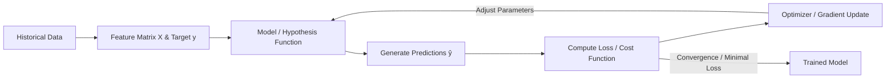
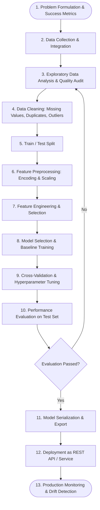

# The Complete Guide to Machine Learning (ML)

A definitive, all-in-one introductory and practical handbook covering machine learning concepts, core paradigms, algorithms, complete end-to-end workflows, data cleaning, categorical encoding, feature scaling, evaluation metrics, and the Python library ecosystem.

---

## Table of Contents
1. [What is Machine Learning?](#1-what-is-machine-learning)
2. [How Machine Learning Works](#2-how-machine-learning-works)
3. [Core Machine Learning Concepts & Terminology](#3-core-machine-learning-concepts--terminology)
4. [The 4 Main Types of Machine Learning](#4-the-4-main-types-of-machine-learning)
5. [Key Machine Learning Algorithms & Techniques](#5-key-machine-learning-algorithms--techniques)
6. [End-to-End Machine Learning Workflow & Flowchart](#6-end-to-end-machine-learning-workflow--flowchart)
7. [Data Cleaning & Quality Audit](#7-data-cleaning--quality-audit)
8. [Feature Preprocessing: Categorical Encoding](#8-feature-preprocessing-categorical-encoding)
9. [Feature Preprocessing: Feature Scaling](#9-feature-preprocessing-feature-scaling)
10. [Model Evaluation & Validation Metrics](#10-model-evaluation--validation-metrics)
11. [Essential Python Libraries Ecosystem](#11-essential-python-libraries-ecosystem)
12. [Complete End-to-End Python Code Pipeline](#12-complete-end-to-end-python-code-pipeline)

---

## 1. What is Machine Learning?

**Machine Learning (ML)** is a branch of Artificial Intelligence (AI) and computer science focused on building algorithms that learn patterns, relationships, and rules directly from historical data to make predictions or decisions without being explicitly programmed.

```
Traditional Programming:
┌──────────────┐      ┌──────────────┐
│     Data     │ +    │ Explicit Code│ ──────► [ Output / Results ]
└──────────────┘      └──────────────┘

Machine Learning:
┌──────────────┐      ┌──────────────┐
│     Data     │ +    │   Answers    │ ──────► [ Learned Rules / Model ]
└──────────────┘      │   (Labels)   │
                      └──────────────┘
```

### Key Differences: AI vs. ML vs. Deep Learning (DL)

| Level | Definition | Characteristics |
| :--- | :--- | :--- |
| **Artificial Intelligence (AI)** | The broad concept of creating machines capable of mimicking human intelligence and behavior. | Includes rule-based systems, expert systems, search heuristics, and ML. |
| **Machine Learning (ML)** | A subset of AI focused on learning statistical models and patterns directly from structured or tabular data. | Relies on feature engineering, mathematical optimization, and statistical algorithms (Linear Models, Trees, SVMs). |
| **Deep Learning (DL)** | A specialized subset of ML using deep multi-layered Artificial Neural Networks (ANNs). | Excels at unstructured data (images, audio, video, raw natural language) with automatic feature extraction. |

---

## 2. How Machine Learning Works

Every machine learning model operates through a continuous mathematical loop:



### The 5 Foundational Steps:
1. **Hypothesis Function ($h_\theta(X)$)**: The mathematical formula the model assumes represents the relationship between inputs $X$ and output $y$ (e.g., $y = \mathbf{w}^T \mathbf{x} + b$).
2. **Prediction ($\hat{y}$)**: The output generated by passing features into the current model parameters.
3. **Loss / Cost Function ($J(\theta)$)**: A mathematical formula calculating how far the model's predictions ($\hat{y}$) are from actual reality ($y$).
4. **Optimization Algorithm (e.g., Gradient Descent)**: An algorithm that calculates the derivative (gradient) of the loss with respect to model parameters and iteratively updates them in the direction that minimizes error:
   $$\theta_{\text{new}} = \theta_{\text{old}} - \alpha \cdot \nabla_{\theta} J(\theta)$$
   *(where $\alpha$ is the learning rate)*.
5. **Inference**: Passing new, unseen data into the trained model to generate predictions.

---

## 3. Core Machine Learning Concepts & Terminology

- **Features ($X$)**: Independent input variables / columns describing each observation (e.g., *Age, Income, Square Footage*).
- **Target / Label ($y$)**: Dependent variable or outcome to predict (e.g., *House Price, Customer Churn, Spam/Not Spam*).
- **Sample / Observation ($m$ or $n$)**: A single row of data containing features and (optionally) a target.
- **Parameters ($\theta$, weights $w$, bias $b$)**: Internal values learned automatically during model training.
- **Hyperparameters**: Configuration settings defined by the engineer *before* training (e.g., learning rate $\alpha$, tree depth, number of estimators $n\_estimators$, regularization strength $C$ or $\lambda$).
- **Overfitting (High Variance)**: The model memorizes training data including noise and quirks, performing exceptionally well on train sets but poorly on unseen test data.
- **Underfitting (High Bias)**: The model is too simplistic to capture the true underlying data patterns, performing poorly on both train and test sets.
- **Bias-Variance Tradeoff**: The fundamental balancing act of choosing a model complex enough to capture signals (low bias) without becoming overly sensitive to noise (low variance).

```
Underfitting (High Bias)        Optimal Balance            Overfitting (High Variance)
        ○     ○                     ○   ○                        ○   ○
      ○  /---\  ○                 ○ /---\ ○                    ○/‾‾‾\○
     ○  /     \  ○               ○ /     \ ○                  ○/     \○
   ────/───────\────            ──/───────\───               ─/───────\─
(Too simple: Line for curve)  (Captures the curve)      (Wiggles through every point)
```

---

## 4. The 4 Main Types of Machine Learning

```
                            ┌────────────────────────────────────────┐
                            │       Machine Learning Paradigms       │
                            └────────────────────────────────────────┘
                                                 │
          ┌──────────────────────┬───────────────┴───────────────┬──────────────────────┐
          │                      │                               │                      │
          ▼                      ▼                               ▼                      ▼
┌──────────────────┐   ┌──────────────────┐            ┌──────────────────┐   ┌──────────────────┐
│    Supervised    │   │   Unsupervised   │            │ Semi-Supervised  │   │  Reinforcement   │
│     Learning     │   │     Learning     │            │     Learning     │   │     Learning     │
└──────────────────┘   └──────────────────┘            └──────────────────┘   └──────────────────┘
│ • Features + Labels  │ • Features Only  │            │ • Small Labeled  │   │ • Agent + Action │
│ • Learn X -> y       │ • Find Patterns  │            │   + Large        │   │ • Environment    │
│ • Classification     │ • Clustering     │            │   Unlabeled      │   │ • Reward Signal  │
│ • Regression         │ • Dim. Reduction │            │ • Pseudo-labeling│   │ • Policy Learn   │
└──────────────────┘   └──────────────────┘            └──────────────────┘   └──────────────────┘
```

### 1. Supervised Learning
Data contains both input features $X$ and true target labels $y$. The objective is to learn a mapping $f(X) \to y$.
- **Regression**: Target $y$ is a continuous numerical value (e.g., predicting sales revenue, stock price, temperature).
- **Classification**: Target $y$ is a discrete categorical class:
  - *Binary Classification*: 2 classes (e.g., Default vs. No Default, Tumor: Malignant vs. Benign).
  - *Multi-class Classification*: 3+ mutually exclusive classes (e.g., classifying vehicle types: Car, Truck, Motorcycle).
  - *Multi-label Classification*: Multiple non-exclusive tags per instance (e.g., a movie tagged as both Action and Comedy).

### 2. Unsupervised Learning
Data contains only input features $X$ with **no labels ($y$)**. The objective is to uncover inherent groupings, structures, or lower-dimensional representations.
- **Clustering**: Grouping similar data points together (e.g., Customer Segmentation).
- **Dimensionality Reduction**: Compressing high-dimensional feature spaces into fewer dimensions while preserving variance (e.g., PCA, t-SNE).
- **Anomaly Detection**: Identifying rare outliers deviating significantly from normal distributions (e.g., credit card fraud, equipment failure).
- **Association Rule Mining**: Uncovering co-occurrence relationships (e.g., Market Basket Analysis: "People who buy beer also buy diapers").

### 3. Semi-Supervised Learning
Combines a small amount of labeled data with a large volume of unlabeled data.
- **Self-Training / Pseudo-Labeling**: Train a model on labeled data, predict labels for high-confidence unlabeled data, add them to the training set, and retrain.
- **Applications**: Medical image analysis where labeling requires expensive human radiologist time.

### 4. Reinforcement Learning (RL)
An autonomous **Agent** learns through trial and error by interacting with an **Environment**.
- Takes an **Action** $A_t$ in **State** $S_t$, receives an immediate or delayed **Reward** $R_{t+1}$, and transitions to **State** $S_{t+1}$.
- **Goal**: Maximize cumulative discounted rewards over time.
- **Applications**: Autonomous driving, robotics, chess/Go engines (AlphaZero), LLM fine-tuning via RLHF (Reinforcement Learning from Human Feedback).

---

## 5. Key Machine Learning Algorithms & Techniques

### A. Supervised Regression Algorithms
1. **Linear Regression (OLS)**: Fits a hyper-plane minimizing sum of squared residuals.
2. **Ridge Regression (L2 Penalty)**: Shrinks regression coefficients towards zero to prevent overfitting on multicollinear data.
3. **Lasso Regression (L1 Penalty)**: Shrinks coefficients strictly to zero, performing automatic feature selection.
4. **ElasticNet**: Blends L1 and L2 penalties for balanced regularization.
5. **Decision Tree Regressor (CART)**: Splits feature space into recursive partitions minimizing leaf node variance.
6. **Random Forest Regressor**: Ensembles multiple decision trees trained on bootstrap samples (Bagging) to reduce prediction variance.
7. **Gradient Boosted Trees (XGBoost, LightGBM, CatBoost)**: Builds trees sequentially (Boosting), each correcting residual errors of the previous ensemble.
8. **Support Vector Regressor (SVR)**: Fits an error boundary ($\epsilon$-tube) with kernel projection (RBF, Polynomial).
9. **$k$-Nearest Neighbors Regressor ($k$-NN)**: Predicts average target of the $k$ closest neighbors in Euclidean feature space.

### B. Supervised Classification Algorithms
1. **Logistic Regression**: Uses Sigmoid $\sigma(z) = \frac{1}{1 + e^{-z}}$ to estimate class probabilities via Log-Loss.
2. **Decision Tree Classifier**: Maximizes node purity using **Gini Impurity** ($1 - \sum p_i^2$) or **Entropy / Information Gain**.
3. **Random Forest Classifier**: Majority vote aggregation across randomized decision trees.
4. **Gradient Boosting Classifiers (GBDT, XGBoost, LightGBM, CatBoost)**: State-of-the-art tree boosting for tabular classification benchmarks.
5. **Support Vector Machines (SVC)**: Finds optimal maximum-margin hyperplane separating classes in high-dimensional kernel spaces.
6. **Naive Bayes**: Fast probabilistic classifier applying Bayes' Theorem assuming conditional feature independence:
   $$P(y|X) = \frac{P(y) \prod P(x_i|y)}{P(X)}$$
7. **$k$-Nearest Neighbors ($k$-NN)**: Classifies query points by majority vote of $k$ closest neighboring points.

### C. Unsupervised Algorithms
1. **$K$-Means Clustering**: Iteratively assigns points to $K$ cluster centroids by minimizing Within-Cluster Sum of Squares (Inertia). Optimal $K$ found via **Elbow Method** and **Silhouette Analysis**.
2. **Hierarchical Agglomerative Clustering**: Bottom-up merging visualized via **Dendrograms**.
3. **DBSCAN**: Density-based clustering that discovers arbitrary shapes and labels sparse outliers as noise.
4. **Principal Component Analysis (PCA)**: Orthogonal linear transformation projecting data onto principal axes of maximum variance.
5. **t-SNE & UMAP**: Non-linear manifold learning algorithms optimized for 2D/3D visualization of complex high-dimensional datasets.

---

## 6. End-to-End Machine Learning Workflow & Flowchart

Every real-world ML project follows a disciplined lifecycle:



---

## 7. Data Cleaning & Quality Audit

Before feeding data into algorithms, raw datasets must be cleaned to eliminate data corruption.

### 1. Handling Missing Data (NaNs / Nulls)
- **Diagnose Missingness Mechanism**:
  - *MCAR (Missing Completely at Random)*: Safe to drop or impute.
  - *MAR (Missing at Random)*: Impute using related features.
  - *MNAR (Missing Not at Random)*: Missingness carries signal (create a binary `is_missing` flag).
- **Imputation Strategies**:
  - **Mean / Median Imputation**: Fast for numerical features (use median if skewed).
  - **Mode Imputation**: Common for categorical variables.
  - **KNN Imputer**: Estimates missing values based on weighted average of nearest neighboring samples (`sklearn.impute.KNNImputer`).
  - **Iterative Imputer (MICE)**: Models each missing feature as a function of other features (`sklearn.impute.IterativeImputer`).

### 2. Handling Duplicate Records
- Identify and remove repeated rows:
  ```python
  df = df.drop_duplicates().reset_index(drop=True)
  ```

### 3. Handling Outliers
Outliers distort mean, variance, distance calculations, and gradient updates.
- **Detection**:
  - **Z-Score Method**: Points with $|Z| > 3$ where $Z = \frac{x - \mu}{\sigma}$.
  - **IQR Rule**: Points outside $[Q_1 - 1.5 \times \text{IQR},\ Q_3 + 1.5 \times \text{IQR}]$.
  - **Isolation Forest**: Unsupervised tree-based anomaly detector (`sklearn.ensemble.IsolationForest`).
- **Treatment**:
  - **Trimming / Dropping**: Remove if confirmed to be entry errors.
  - **Winsorization / Capping**: Cap extreme values at 1st and 99th percentiles.
  - **Log / Power Transformation**: Compresses long-tailed distributions ($x \to \log(1 + x)$).

---

## 8. Feature Preprocessing: Categorical Encoding

Machine learning models are mathematical functions that only accept numerical matrices. Textual categories must be encoded numerically.

```
                  ┌────────────────────────────────────────┐
                  │          Categorical Features          │
                  └────────────────────────────────────────┘
                                      │
                 ┌────────────────────┴────────────────────┐
                 ▼                                         ▼
     ┌───────────────────────┐                 ┌───────────────────────┐
     │   Nominal Variables   │                 │   Ordinal Variables   │
     │  (No natural order)   │                 │  (Clear ranked order) │
     │  e.g. Red, Blue, Green│                 │  e.g. Low, Med, High  │
     └───────────────────────┘                 └───────────────────────┘
                 │                                         │
        ┌────────┴────────┐                                │
        ▼                 ▼                                ▼
┌──────────────┐  ┌──────────────┐                 ┌──────────────┐
│One-Hot Encode│  │Target Encode │                 │Ordinal Encode│
│(Low-cardinal)│  │(High-cardin.)│                 │  (1, 2, 3)   │
└──────────────┘  └──────────────┘                 └──────────────┘
```

### Encoding Methods Comparison

| Encoding Technique | Description | Best Used For | Scikit-Learn Class | Notes / Risks |
| :--- | :--- | :--- | :--- | :--- |
| **One-Hot Encoding** | Creates a binary $0/1$ column for each unique category. | Nominal features with low cardinality ($< 15$ categories). | `OneHotEncoder(drop='first', sparse_output=False)` | Drop first category for linear models to avoid dummy variable trap. |
| **Ordinal Encoding** | Maps ordered categories to ranked integers ($0, 1, 2, \dots$). | Features with explicit rank (*Education: High School=0, BS=1, MS=2, PhD=3*). | `OrdinalEncoder(categories=[['Low', 'Medium', 'High']])` | Do not use on nominal data (imposes false ordering). |
| **Label Encoding** | Encodes target categories into integer codes. | **Target labels ($y$) only**, never features ($X$). | `LabelEncoder` | Strict 1D vector encoder. |
| **Target / Mean Encoding** | Replaces category with the average target value for that category. | High-cardinality nominal features (*Zip codes, City names*). | `category_encoders.TargetEncoder` | Prone to target leakage without smoothing/K-fold out-of-fold calculation. |
| **Frequency / Count Encoding** | Replaces category with its relative frequency count. | High-cardinality features where rarity carries signal. | Custom / `feature_engine` | Fast, avoids dimensionality expansion. |

---

## 9. Feature Preprocessing: Feature Scaling

### Why Scaling is Mandatory
Algorithms calculating Euclidean/Manhattan distances ($k$-NN, $K$-Means, SVMs, PCA) or using Gradient Descent (Linear/Logistic Regression, Neural Networks) will give disproportionately huge weight to features with larger numeric scales (*e.g., Salary: \$100,000 vs. Age: 30*).

> **Note**: Tree-based models (Decision Trees, Random Forests, XGBoost) are **scale-invariant** and do not require feature scaling.

```
       Original Features                      Standardized (Z-Score)
  Salary ($)                             Salary (Z)
  100k ┼          ●                        2 ┼          ●
       │      ●                              │      ●
   50k ┼  ●                                0 ┼  ●
       │                                     │
     0 ┼───┼───┼───┼─── Age (Years)         -2 ┼───┼───┼───┼─── Age (Z)
       0  20  40  60                        -2  -1   0   1   2
 (Distance dominated by Salary)            (Both features contribute equally)
```

### Scaling Techniques Comparison

| Scaler | Mathematical Formula | Output Range | Outlier Sensitivity | Best Used When |
| :--- | :--- | :--- | :--- | :--- |
| **StandardScaler** | $z = \frac{x - \mu}{\sigma}$ | $\mu=0, \sigma=1$ ($(-\infty, \infty)$) | Moderate | Features are normally distributed; standard for linear models, SVM, PCA. |
| **MinMaxScaler** | $x_{\text{scaled}} = \frac{x - x_{\text{min}}}{x_{\text{max}} - x_{\text{min}}}$ | Strictly $[0, 1]$ | High (Compresses inlier range) | Algorithms requiring strictly bounded values (Image pixels, Neural nets). |
| **RobustScaler** | $x_{\text{scaled}} = \frac{x - Q_2}{Q_3 - Q_1}$ | Centered at 0 (IQR scaled) | **Very Low (Outlier Resistant)** | Dataset contains significant outliers that cannot be removed. |
| **MaxAbsScaler** | $x_{\text{scaled}} = \frac{x}{\|x_{\text{max}}\|}$ | $[-1, 1]$ | High | Sparse matrices where preserving zero entries is critical. |

> [!IMPORTANT]
> **Data Leakage Rule**: Always `fit_transform()` only on the **Train Set**, and call `transform()` on the **Validation/Test Set**. Never fit a scaler or encoder on the entire combined dataset!

---

## 10. Model Evaluation & Validation Metrics

### A. Classification Metrics

#### 1. Confusion Matrix
| | Predicted Negative ($\hat{y}=0$) | Predicted Positive ($\hat{y}=1$) |
| :--- | :--- | :--- |
| **Actual Negative ($y=0$)** | **True Negative (TN)** | **False Positive (FP)** *(Type I Error)* |
| **Actual Positive ($y=1$)** | **False Negative (FN)** *(Type II Error)* | **True Positive (TP)** |

- **Accuracy**: $\frac{TP + TN}{TP + TN + FP + FN}$ *(Misleading on imbalanced datasets!)*
- **Precision**: $\frac{TP}{TP + FP}$ *(Cost of False Alarm is high, e.g., Spam detection)*
- **Recall (Sensitivity / TPR)**: $\frac{TP}{TP + FN}$ *(Cost of False Negative is severe, e.g., Cancer detection)*
- **F1-Score**: $2 \times \frac{\text{Precision} \times \text{Recall}}{\text{Precision} + \text{Recall}}$ *(Harmonic mean; ideal for class imbalance)*
- **ROC-AUC**: Measures the area under the Receiver Operating Characteristic curve (TPR vs FPR across all probability thresholds). Score $1.0$ is perfect; $0.5$ is random guessing.

### B. Regression Metrics
- **Mean Absolute Error (MAE)**: $\frac{1}{n} \sum |y_i - \hat{y}_i|$ — Intuitive, robust to outliers.
- **Mean Squared Error (MSE)**: $\frac{1}{n} \sum (y_i - \hat{y}_i)^2$ — Penalizes large errors heavily.
- **Root Mean Squared Error (RMSE)**: $\sqrt{\text{MSE}}$ — In the same units as target $y$.
- **$R^2$ Score (Coefficient of Determination)**: $1 - \frac{\sum (y_i - \hat{y}_i)^2}{\sum (y_i - \bar{y})^2}$ — Proportion of variance explained by the model ($1.0$ is perfect, $\le 0.0$ is worse than baseline mean).

### C. Validation Strategies
- **Train / Test Split**: Fast split (e.g., 80% train, 20% test).
- **$K$-Fold Cross-Validation**: Splits train data into $K$ equal folds, rotating validation on each fold to produce robust performance bounds.
- **Stratified $K$-Fold**: Preserves the exact class target proportions in each fold (mandatory for classification).
- **Time-Series Split (Rolling Window)**: Strictly prohibits evaluating on past data when predicting future points.

---

## 11. Essential Python Libraries Ecosystem

Here is the complete toolkit of essential Python libraries required for modern machine learning:

```
┌─────────────────────────────────────────────────────────────────────────────┐
│                             The Python ML Stack                             │
├─────────────────────────────────────────────────────────────────────────────┤
│ 1. Core Data & Math    : NumPy, Pandas, Polars, SciPy                       │
│ 2. Data Visualization  : Matplotlib, Seaborn, Plotly, Yellowbrick           │
│ 3. Core ML & Pipelines : Scikit-Learn, Statsmodels, Imbalanced-Learn        │
│ 4. Boosting Ensembles  : XGBoost, LightGBM, CatBoost                        │
│ 5. Hyperparameter Tuning: Optuna, Hyperopt                                  │
│ 6. Explainability (XAI): SHAP, LIME                                         │
│ 7. Serialization & APIs: Joblib, FastAPI, Streamlit, MLflow                 │
└─────────────────────────────────────────────────────────────────────────────┘
```

### Detailed Breakdown

| Category | Library | Primary Functionality | Official Documentation |
| :--- | :--- | :--- | :--- |
| **Data Manipulation** | `numpy` | N-dimensional array processing, fast vector math. | [numpy.org](https://numpy.org/) |
| | `pandas` | Tabular DataFrames, filtering, aggregation, grouping. | [pandas.pydata.org](https://pandas.pydata.org/) |
| | `polars` | Ultra-fast multithreaded DataFrame library in Rust. | [pola.rs](https://pola.rs/) |
| | `scipy` | Scientific computing, optimization, statistical tests. | [scipy.org](https://scipy.org/) |
| **Visualization** | `matplotlib` | Low-level plotting and chart canvas rendering. | [matplotlib.org](https://matplotlib.org/) |
| | `seaborn` | Statistical visualizations (heatmaps, violin/box plots). | [seaborn.pydata.org](https://seaborn.pydata.org/) |
| | `plotly` | Interactive 2D/3D web-ready visual plots. | [plotly.com/python](https://plotly.com/python/) |
| | `yellowbrick` | Machine learning visual diagnostics and curve plotting. | [scikit-yb.org](https://www.scikit-yb.org/) |
| **Classical ML** | `scikit-learn` | Comprehensive ML algorithms, preprocessing, pipelines. | [scikit-learn.org](https://scikit-learn.org/) |
| | `statsmodels` | Econometric regression, ANOVA, and time-series (ARIMA). | [statsmodels.org](https://www.statsmodels.org/) |
| | `imbalanced-learn`| SMOTE and undersampling for imbalanced datasets. | [imbalanced-learn.org](https://imbalanced-learn.org/) |
| **Gradient Boosting** | `xgboost` | High-performance scalable gradient boosting trees. | [xgboost.readthedocs.io](https://xgboost.readthedocs.io/) |
| | `lightgbm` | Fast, memory-efficient leaf-wise tree boosting. | [lightgbm.readthedocs.io](https://lightgbm.readthedocs.io/) |
| | `catboost` | State-of-the-art native handling of categorical features. | [catboost.ai](https://catboost.ai/) |
| **Feature Engineering** | `category_encoders` | Target, Weight of Evidence, and James-Stein encoders. | [contrib.scikit-learn.org](https://contrib.scikit-learn.org/category_encoders/) |
| | `feature-engine` | Specialized transformers for imputation and discretizing. | [feature-engine.trainindata.com](https://feature-engine.trainindata.com/) |
| **Optimization (AutoML)**| `optuna` | Fast Bayesian Hyperparameter optimization framework. | [optuna.org](https://optuna.org/) |
| **Model Explainability** | `shap` | Game-theoretic Shapley feature attribution. | [shap.readthedocs.io](https://shap.readthedocs.io/) |
| | `lime` | Local interpretable model-agnostic explanations. | [github.com/marcotcr/lime](https://github.com/marcotcr/lime) |
| **Deployment & Tracking**| `joblib` | High-speed model serialization and persistence. | [joblib.readthedocs.io](https://joblib.readthedocs.io/) |
| | `fastapi` | High-performance Python web API framework for models. | [fastapi.tiangolo.com](https://fastapi.tiangolo.com/) |
| | `streamlit` | Rapid interactive dashboard web apps for ML models. | [streamlit.io](https://streamlit.io/) |
| | `mlflow` | Model experiment tracking, registry, and deployment. | [mlflow.org](https://mlflow.org/) |

### Quick Installation Command
Install all essential core machine learning libraries in one command:
```bash
pip install numpy pandas scipy scikit-learn matplotlib seaborn xgboost lightgbm catboost optuna shap joblib
```

---

## 12. Complete End-to-End Python Code Pipeline

Below is a production-grade, complete Python script demonstrating data preparation with mixed numerical and categorical features, imputation, encoding, scaling, model training via `Pipeline` and `ColumnTransformer`, hyperparameter search with Cross-Validation, evaluation, and model serialization.

```python
import joblib
import numpy as np
import pandas as pd

from sklearn.model_selection import train_test_split, GridSearchCV, StratifiedKFold
from sklearn.compose import ColumnTransformer
from sklearn.pipeline import Pipeline
from sklearn.impute import SimpleImputer
from sklearn.preprocessing import StandardScaler, OneHotEncoder
from sklearn.ensemble import RandomForestClassifier
from sklearn.metrics import classification_report, roc_auc_score, confusion_matrix

# -------------------------------------------------------------
# 1. Create a Realistic Synthetic Dataset (Mixed Data Types)
# -------------------------------------------------------------
np.random.seed(42)
n_samples = 1000

data = {
    'age': np.random.randint(18, 70, size=n_samples).astype(float),
    'annual_income': np.random.normal(60000, 15000, size=n_samples),
    'credit_score': np.random.randint(300, 850, size=n_samples).astype(float),
    'education': np.random.choice(['High School', 'Bachelor', 'Master', 'PhD'], size=n_samples),
    'city': np.random.choice(['New York', 'Chicago', 'San Francisco', 'Austin'], size=n_samples),
    'defaulted': np.random.choice([0, 1], size=n_samples, p=[0.75, 0.25])
}
df = pd.DataFrame(data)

# Inject synthetic missing values (NaNs) to simulate real-world data
df.loc[np.random.choice(n_samples, 40), 'annual_income'] = np.nan
df.loc[np.random.choice(n_samples, 20), 'education'] = np.nan

# -------------------------------------------------------------
# 2. Separate Features and Target
# -------------------------------------------------------------
X = df.drop(columns=['defaulted'])
y = df['defaulted']

# Identify numerical and categorical columns
num_features = ['age', 'annual_income', 'credit_score']
cat_features = ['education', 'city']

# -------------------------------------------------------------
# 3. Train-Test Split (Stratified to maintain class ratios)
# -------------------------------------------------------------
X_train, X_test, y_train, y_test = train_test_split(
    X, y, test_size=0.20, random_state=42, stratify=y
)

# -------------------------------------------------------------
# 4. Construct Preprocessing Pipelines (ColumnTransformer)
# -------------------------------------------------------------
# Pipeline for Numerical Features: Impute median -> Scale with StandardScaler
num_pipeline = Pipeline(steps=[
    ('imputer', SimpleImputer(strategy='median')),
    ('scaler', StandardScaler())
])

# Pipeline for Categorical Features: Impute mode -> One-Hot Encode
cat_pipeline = Pipeline(steps=[
    ('imputer', SimpleImputer(strategy='most_frequent')),
    ('encoder', OneHotEncoder(drop='first', handle_unknown='ignore', sparse_output=False))
])

# Combine both numerical and categorical transformers
preprocessor = ColumnTransformer(transformers=[
    ('num', num_pipeline, num_features),
    ('cat', cat_pipeline, cat_features)
])

# -------------------------------------------------------------
# 5. Build Full End-to-End Pipeline
# -------------------------------------------------------------
full_pipeline = Pipeline(steps=[
    ('preprocessor', preprocessor),
    ('classifier', RandomForestClassifier(random_state=42))
])

# -------------------------------------------------------------
# 6. Hyperparameter Tuning via GridSearchCV
# -------------------------------------------------------------
param_grid = {
    'classifier__n_estimators': [50, 100, 150],
    'classifier__max_depth': [None, 5, 10],
    'classifier__min_samples_split': [2, 5]
}

cv = StratifiedKFold(n_splits=5, shuffle=True, random_state=42)

grid_search = GridSearchCV(
    estimator=full_pipeline,
    param_grid=param_grid,
    cv=cv,
    scoring='roc_auc',
    n_jobs=-1
)

print("Training Pipeline with 5-Fold Cross-Validation...")
grid_search.fit(X_train, y_train)

# -------------------------------------------------------------
# 7. Model Evaluation on Unseen Test Set
# -------------------------------------------------------------
best_model = grid_search.best_estimator_
y_pred = best_model.predict(X_test)
y_proba = best_model.predict_proba(X_test)[:, 1]

print(f"\nOptimal Hyperparameters: {grid_search.best_params_}")
print(f"Test ROC-AUC Score: {roc_auc_score(y_test, y_proba):.4f}\n")

print("Confusion Matrix:")
print(confusion_matrix(y_test, y_pred))

print("\nClassification Report:")
print(classification_report(y_test, y_pred, target_names=['No Default', 'Default']))

# -------------------------------------------------------------
# 8. Model Serialization (Persistence)
# -------------------------------------------------------------
model_filename = "ml_loan_default_pipeline.joblib"
joblib.dump(best_model, model_filename)
print(f"\nComplete trained pipeline successfully saved to '{model_filename}'!")

# -------------------------------------------------------------
# 9. Verify Inference on Fresh New Raw Data
# -------------------------------------------------------------
loaded_model = joblib.load(model_filename)
new_applicant = pd.DataFrame([{
    'age': 35.0,
    'annual_income': 75000.0,
    'credit_score': 720.0,
    'education': 'Master',
    'city': 'San Francisco'
}])

prediction = loaded_model.predict(new_applicant)[0]
probability = loaded_model.predict_proba(new_applicant)[0, 1]

print(f"\nFresh Prediction for new applicant: {'Default' if prediction == 1 else 'No Default'} (Risk Prob: {probability:.2%})")
```
