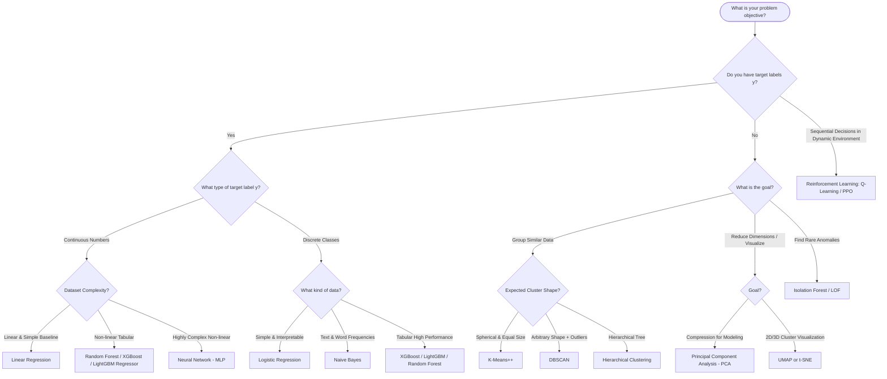

# Comprehensive Machine Learning Algorithms Study Guide: Supervised, Unsupervised, Reinforcement Learning & Cross-Validation

A conceptual, theory-focused guide explaining Machine Learning paradigms, algorithms, their inner working mechanisms, what they are used for (Classification, Regression, Clustering, Dimensionality Reduction, Control), intuitive math foundations, and robust Cross-Validation strategies.

---

## Table of Contents
1. [Taxonomy of Machine Learning](#1-taxonomy-of-machine-learning)
2. [Supervised Learning](#2-supervised-learning)
   - [2.1 Regression: Linear Regression](#21-regression-linear-regression)
   - [2.2 Classification: Logistic Regression](#22-classification-logistic-regression)
   - [2.3 Classification: Naive Bayes](#23-classification-naive-bayes)
   - [2.4 Classification & Regression: K-Nearest Neighbors (KNN)](#24-classification--regression-k-nearest-neighbors-knn)
   - [2.5 Classification & Regression: Decision Trees](#25-classification--regression-decision-trees)
   - [2.6 Ensemble Learning: Bagging & Random Forest](#26-ensemble-learning-bagging--random-forest)
   - [2.7 Ensemble Learning: Boosting (AdaBoost, GBM, XGBoost, LightGBM, CatBoost)](#27-ensemble-learning-boosting-adaboost-gbm-xgboost-lightgbm-catboost)
   - [2.8 Ensembles: Voting & Stacking](#28-ensembles-voting--stacking)
   - [2.9 Neural Networks / Multi-Layer Perceptron (MLP)](#29-neural-networks--multi-layer-perceptron-mlp)
3. [Unsupervised Learning](#3-unsupervised-learning)
   - [3.1 Clustering: K-Means & K-Means++](#31-clustering-k-means--k-means)
   - [3.2 Clustering: Hierarchical Clustering](#32-clustering-hierarchical-clustering)
   - [3.3 Clustering: DBSCAN](#33-clustering-dbscan)
   - [3.4 Dimensionality Reduction: Principal Component Analysis (PCA)](#34-dimensionality-reduction-principal-component-analysis-pca)
   - [3.5 Manifold Learning: t-SNE & UMAP](#35-manifold-learning-t-sne--umap)
   - [3.6 Anomaly Detection: Isolation Forest & Local Outlier Factor](#36-anomaly-detection-isolation-forest--local-outlier-factor)
4. [Reinforcement Learning (RL)](#4-reinforcement-learning-rl)
   - [4.1 Core Concepts & The RL Framework](#41-core-concepts--the-rl-framework)
   - [4.2 Exploration vs. Exploitation](#42-exploration-vs-exploitation)
   - [4.3 Value-Based Methods: Q-Learning, SARSA & DQN](#43-value-based-methods-q-learning-sarsa--dqn)
   - [4.4 Policy-Based & Actor-Critic Methods: REINFORCE, A2C, PPO](#44-policy-based--actor-critic-methods-reinforce-a2c-ppo)
   - [4.5 Real-World Applications](#45-real-world-applications)
5. [Cross-Validation (CV) & Validation Strategies](#5-cross-validation-cv--validation-strategies)
   - [5.1 Why Simple Train/Test Split Fails](#51-why-simple-traintest-split-fails)
   - [5.2 Cross-Validation Techniques](#52-cross-validation-techniques)
   - [5.3 Preventing Data Leakage with Pipelines](#53-preventing-data-leakage-with-pipelines)
   - [5.4 Hyperparameter Tuning with CV: GridSearchCV & RandomizedSearchCV](#54-hyperparameter-tuning-with-cv-gridsearchcv--randomizedsearchcv)
6. [Master Algorithm Comparison & Decision Guide](#6-master-algorithm-comparison--decision-guide)

---

# 1. Taxonomy of Machine Learning

Machine Learning algorithms are categorized based on how they receive feedback and learn patterns from data:

```
                               ┌──────────────────────────────────────────────────────────┐
                               │                 Machine Learning Paradigms               │
                               └────────────────────────────┬─────────────────────────────┘
                                                            │
         ┌──────────────────────────────────────────────────┼─────────────────────────────────────────────────┐
         │                                                  │                                                 │
┌────────▼────────┐                                ┌────────▼────────┐                               ┌────────▼────────┐
│   Supervised    │                                │  Unsupervised   │                               │  Reinforcement  │
│    Learning     │                                │    Learning     │                               │    Learning     │
└────────┬────────┘                                └────────┬────────┘                               └────────┬────────┘
         │                                                  │                                                 │
 ┌───────┴───────┐                                  ┌───────┴───────┐                                 ┌───────┴───────┐
 │               │                                  │               │                                 │               │
┌▼─────────────┐┌▼─────────────┐                   ┌▼─────────────┐┌▼─────────────┐                  ┌▼─────────────┐┌▼─────────────┐
│Classification││ Regression   │                   │  Clustering  ││Dimensionality│                  │ Value-Based  ││ Policy-Based │
│  (Discrete)  ││ (Continuous) │                   │  (Grouping)  ││  Reduction   │                  │ (Q-Learning) ││    (PPO)     │
└──────────────┘└──────────────┘                   └──────────────┘└──────────────┘                  └──────────────┘└──────────────┘
```

| Dimension | Supervised Learning | Unsupervised Learning | Reinforcement Learning |
| :--- | :--- | :--- | :--- |
| **Input Data** | Labeled dataset $(X, y)$ | Unlabeled feature matrix $X$ | States $s$ from an active environment |
| **Supervisory Signal** | Explicit target values/classes ($y$) | None (discovers intrinsic structure) | Scalar reward signals ($r$) based on actions taken |
| **Core Goal** | Learn a mapping function $f(X) \to y$ | Find hidden groupings, patterns, or compress data | Learn an optimal decision policy $\pi(s) \to a$ to maximize cumulative rewards |
| **Primary Tasks** | Classification, Regression | Clustering, Dimensionality Reduction, Anomaly Detection | Autonomous Control, Game Playing, Robotics, LLM Alignment (RLHF) |

---

# 2. Supervised Learning

Supervised learning algorithms build a mathematical model from a dataset containing both input features $X$ and corresponding ground-truth output labels $y$.

---

## 2.1 Regression: Linear Regression

- **Used For**: **Regression** (predicting continuous numerical values like house prices, temperature, sales volume, stock returns).
- **Theoretical Intuition**: Assumes that the output variable has a linear relationship with the input features. It attempts to fit a straight line (in 2D), plane (in 3D), or hyperplane (in higher dimensions) through data points such that the collective distance between data points and the line is minimized.

```
       Target (y)
           ▲               ● (Actual Data Point)
           │             / 
           │       ●   / ── Residual Error (e = y - ŷ)
           │         /  ●
           │   ●   / 
           │     / ── Best-fit Regression Line: ŷ = wx + b
           │   /  ●
           └──────────────────────────► Feature (x)
```

- **Core Math Concept**:
  - **Hypothesis Equation**:
    $$\hat{y} = w_1 x_1 + w_2 x_2 + \dots + w_d x_d + b$$
  - **Loss Function (Mean Squared Error - MSE)**:
    $$J(w, b) = \frac{1}{n} \sum_{i=1}^n (y_i - \hat{y}_i)^2$$
- **How It Learns**:
  - **Analytical Method (Normal Equation)**: Computes exact optimal weights directly in one matrix step: $w = (X^T X)^{-1} X^T y$.
  - **Iterative Method (Gradient Descent)**: Starts with random weights and takes small steps in the opposite direction of the loss gradient until it reaches the lowest error.
- **Strengths**: Highly interpretable, very fast to train and predict, clear baseline model.
- **Limitations**: Cannot capture non-linear relationships without manual feature transformations; sensitive to extreme outliers.

---

## 2.2 Classification: Logistic Regression

- **Used For**: **Binary & Multiclass Classification** (spam vs. not spam, customer churn prediction, disease diagnosis, credit default).
- **Theoretical Intuition**: Despite its name, Logistic Regression is a **classification** model. It calculates a linear score from input features, then compresses that score into an S-shaped curve between $0$ and $1$ using the **Sigmoid function**. The output is interpreted as the probability that an observation belongs to the positive class.

```
       Probability P(y=1)
           1.0 ┼                           ●●●●●●● (Class 1)
               │                       . ───
               │                    /
           0.5 ┼ - - - - - - - - - / - - - - - - - (Decision Threshold)
               │                /
               │          ─── .
           0.0 ┼●●●●●●● (Class 0)
               └───────────────────┼───────────────────► Linear Score (z = wx + b)
                                  z=0
```

- **Core Math Concept**:
  - **Sigmoid Function**:
    $$P(y=1 \mid x) = \sigma(z) = \frac{1}{1 + e^{-z}}, \quad \text{where } z = w^T x + b$$
  - **Decision Rule**: If $P(y=1 \mid x) \ge 0.5$, predict Class 1; otherwise predict Class 0.
  - **Loss Function (Binary Cross-Entropy / Log Loss)**:
    $$\text{Log Loss} = -\frac{1}{n} \sum_{i=1}^n \left[ y_i \ln(\hat{p}_i) + (1 - y_i) \ln(1 - \hat{p}_i) \right]$$
- **Multiclass Extension**:
  - **Softmax Regression**: Generalizes the sigmoid to $K$ classes, converting logits into a probability distribution where all class probabilities sum to 1.
- **Strengths**: Outputs calibrated probabilities (not just hard class labels), easy to explain feature impact via odds ratios.
- **Limitations**: Assumes a linear decision boundary between classes; struggles with complex non-linear interactions.

---

## 2.3 Classification: Naive Bayes

- **Used For**: **Classification** (text classification, spam detection, sentiment analysis, document tagging).
- **Theoretical Intuition**: Built entirely on **Bayes' Theorem** of conditional probability. It asks: *"Given the words/features present in this sample, which class has the highest probability of having produced them?"*
  It is called **"Naive"** because it assumes that all features are completely independent of each other given the class (e.g., in spam detection, the presence of the word "free" is treated as independent of the word "money", even though they often appear together).

```
                      P(Class | Features) = P(Class) * P(Features | Class) / P(Features)
```

- **Core Math Concept**:
  $$\hat{y} = \arg\max_{c} \left[ P(y=c) \prod_{j=1}^d P(x_j \mid y=c) \right]$$
- **Common Types**:
  - **Gaussian Naive Bayes**: For continuous numerical features (assumes bell-curve distribution).
  - **Multinomial Naive Bayes**: For word counts and frequency tables in NLP text classification.
  - **Bernoulli Naive Bayes**: For binary presence/absence features (word is present: 1, absent: 0).
- **Strengths**: Extremely fast to train, requires very little data, works exceptionally well with high-dimensional text data.
- **Limitations**: The independence assumption is rarely true in the real world; outputs poor probability calibration.

---

## 2.4 Classification & Regression: K-Nearest Neighbors (KNN)

- **Used For**: **Classification & Regression** (recommendation systems, pattern recognition, spatial query lookup).
- **Theoretical Intuition**: Known as a "lazy learner" or instance-based learner. KNN does not build an abstract mathematical model during training; it simply stores the training dataset. When a new query point arrives, KNN looks for the **$K$ most similar (closest) training samples** in the feature space and bases its prediction on them.

```
                     Class A (●)         Class B (▲)
                            ●               ▲
                               ●   ? (Query)   ▲
                            ●     / \          ▲
                                 /   \
                         Identifies K closest neighbors:
                         - Classification: Majority Vote
                         - Regression: Average Value
```

- **How Predictions Work**:
  - **For Classification**: Takes a majority vote among the $K$ nearest neighbors.
  - **For Regression**: Takes the average (mean) value of the $K$ nearest neighbors.
  - **Distance Metrics**: Usually **Euclidean Distance** ($L_2$) or **Manhattan Distance** ($L_1$).
- **Crucial Rule**: **Feature Scaling is required** (e.g. StandardScaler) so that features with large numerical ranges (like salary) do not overpower features with small ranges (like age).
- **Strengths**: Intuitive, zero training time, naturally handles multi-class and non-linear data.
- **Limitations**: Slow at test/query time because it must calculate distances to every single training point; degrades in high-dimensional spaces (Curse of Dimensionality).

---

## 2.5 Classification & Regression: Decision Trees

- **Used For**: **Classification & Regression** (credit risk scoring, customer segmentation rules, medical diagnosis trees).
- **Theoretical Intuition**: Models decisions as a flowchart-like tree structure. Starting at the root node, the tree asks sequential yes/no questions about feature values, splitting the data into smaller, purer subsets until it reaches terminal leaf nodes.

```
                              [ Income > $50,000? ]
                                   /        \
                             Yes  /          \ No
                                 /            \
                        [ Credit Score > 700? ]  [ Default = Yes ]
                             /         \
                       Yes  /           \ No
                           /             \
                  [ Approved ]     [ High Risk ]
```

- **Core Concepts**:
  - **Purity / Splitting Criteria**:
    - **Gini Impurity** (Classification): Measures how mixed the classes are in a node ($0 = \text{pure}$).
    - **Entropy / Information Gain** (Classification): Measures uncertainty reduction after a split.
    - **Variance / MSE Reduction** (Regression): Chooses the split that minimizes squared errors of the subsets.
  - **Pruning**: Limiting tree depth (`max_depth`) or setting minimum samples per leaf (`min_samples_leaf`) to stop the tree from memorizing noise.
- **Strengths**: Highly interpretable (can be visualized and explained to non-technical stakeholders), handles both numerical and categorical data without scaling.
- **Limitations**: High variance (small changes in training data produce completely different trees); prone to overfitting if unconstrained.

---

## 2.6 Ensemble Learning: Bagging & Random Forest

- **Used For**: **Classification & Regression** (robust general-purpose tabular modeling, churn prediction, feature importance ranking).
- **Theoretical Intuition (Ensemble Principle)**: "The wisdom of crowds." Instead of relying on a single complex decision tree, ensemble methods combine multiple individual models to achieve higher accuracy and stability.

```
Original Dataset ──► [ Bootstrap Sample 1 ] ──► [ Deep Tree 1 ] ──┐
                 ──► [ Bootstrap Sample 2 ] ──► [ Deep Tree 2 ] ──┼──► [ Majority Vote / Average ] ──► Final Output
                 ──► [ Bootstrap Sample 3 ] ──► [ Deep Tree 3 ] ──┘
```

- **Bagging (Bootstrap Aggregation)**:
  - Creates multiple subsets of the training data by **sampling with replacement** (bootstrapping).
  - Trains an independent, deep decision tree on each bootstrap sample.
  - Averages all predictions together. This drastically reduces model **variance** (overfitting) while keeping bias low.
- **Pasting**: Similar to bagging, but draws sample subsets **without replacement**.
- **Random Forest**:
  - Extends Bagging by adding **Feature Subsampling**: at every split in every tree, the algorithm considers only a random subset of features (typically $\sqrt{d}$).
  - This prevents dominant features from making all trees look identical, resulting in diverse, de-correlated trees that generalize much better.
- **Strengths**: One of the most robust off-the-shelf ML algorithms; rarely overfits compared to single trees; automatically provides feature importance scores.
- **Limitations**: Less interpretable than a single decision tree; requires more memory and compute to train hundreds of trees.

---

## 2.7 Ensemble Learning: Boosting (AdaBoost, GBM, XGBoost, LightGBM, CatBoost)

- **Used For**: **Classification, Regression & Ranking** (competitive tabular benchmarks, fraud detection, search ranking, risk forecasting).
- **Theoretical Intuition**: While Bagging builds models in parallel to reduce variance, **Boosting builds models sequentially to reduce bias**. Each new model focuses specifically on the mistakes made by the previous models.

```
Iter 1: [ Tree 1 ] ──► Identifies Errors ──► Iter 2: [ Tree 2 Fits Errors ] ──► Iter 3: [ Tree 3 ] ──► Weighted Ensemble
```

### Key Boosting Algorithms Explained:

1. **AdaBoost (Adaptive Boosting)**:
   - Starts with equal sample weights.
   - After each weak learner (decision stump) is trained, it increases the weights of misclassified samples so the next learner is forced to focus on the hardest cases.
2. **Gradient Boosting Machine (GBM)**:
   - Instead of reweighting samples, GBM trains each new tree directly on the **residual errors** (the difference between actual values and current predictions) of the preceding trees using gradient descent.
3. **XGBoost (Extreme Gradient Boosting)**:
   - An optimized, regularized implementation of Gradient Boosting. Uses 2nd-order Taylor expansion (gradients + hessians) to calculate exact tree splits and includes $L_1/L_2$ penalties to prevent overfitting.
4. **LightGBM**:
   - Designed for massive speed and memory efficiency. Uses **Histogram-based binning** (grouping continuous features into 256 discrete bins) and **Leaf-wise tree growth** (splitting the single leaf with the highest loss reduction rather than growing level-by-level).
5. **CatBoost**:
   - Specifically optimized for datasets with many **categorical features**. Uses ordered target encoding to prevent data leakage and builds symmetric (oblivious) trees for ultra-fast prediction inference.

- **Strengths**: Consistently achieves top-tier performance on structured/tabular data.
- **Limitations**: Sequential training makes it harder to parallelize than Random Forest; more sensitive to noisy data and outliers.

---

## 2.8 Ensembles: Voting & Stacking

- **Used For**: **Classification & Regression** (squeezing maximum predictive performance out of diverse models).
- **Voting Ensemble**:
  - Combines predictions from different model types (e.g. Logistic Regression + Random Forest + XGBoost).
  - **Hard Voting**: Takes the majority class prediction.
  - **Soft Voting**: Averages the predicted class probabilities.
- **Stacking (Stacked Generalization)**:
  - Trains several base models (**Level-0**).
  - Uses their out-of-fold predictions as input features to train a final meta-model (**Level-1**, like Logistic Regression) that learns how to best blend their strengths.

---

## 2.9 Neural Networks / Multi-Layer Perceptron (MLP)

- **Used For**: **Complex Non-linear Classification & Regression** (image classification, audio processing, tabular prediction with complex interactions).
- **Theoretical Intuition**: Inspired by biological neurons. Consists of an input layer, one or more hidden layers, and an output layer. Each neuron performs a weighted sum of its inputs, adds a bias, and passes the result through a non-linear **activation function** (such as ReLU, Sigmoid, or Tanh).

```
  [ Input Layer ]           [ Hidden Layer ]          [ Output Layer ]
     Feature x1 ───────► ( Neuron 1 ) ───────►
                                                 ( Output ŷ )
     Feature x2 ───────► ( Neuron 2 ) ───────►
```

- **Learning Mechanism**:
  1. **Forward Propagation**: Computes layer-by-layer predictions and calculates the loss.
  2. **Backpropagation**: Calculates how much each weight contributed to the error using the calculus chain rule.
  3. **Optimizer Update**: Updates weights using Gradient Descent (or Adam/RMSprop) to minimize error.

---

# 3. Unsupervised Learning

Unsupervised learning algorithms operate on datasets **without target labels $y$**. Their goal is to discover underlying structures, natural groupings, representations, or anomalies within feature matrix $X$.

---

## 3.1 Clustering: K-Means & K-Means++

- **Used For**: **Customer Segmentation, Market Basket Grouping, Document Clustering, Image Compression**.
- **Theoretical Intuition**: Partitions $n$ data points into $K$ distinct, non-overlapping clusters. It positions $K$ cluster centers (**centroids**) and assigns each data point to its nearest centroid.

```
       Feature 2
           ▲        ● ● ● (Cluster 1)
           │       ●  ★ (Centroid 1)
           │        ● ●
           │
           │                     ▲ ▲ ▲ (Cluster 2)
           │                    ▲  ★ (Centroid 2)
           │                     ▲ ▲
           └───────────────────────────────────► Feature 1
```

- **How K-Means Works (Step-by-Step)**:
  1. **Initialize**: Place $K$ centroids randomly in the feature space.
  2. **Assign**: Assign every data point to its closest centroid (using Euclidean distance).
  3. **Update**: Recalculate each centroid position as the mathematical mean of all points assigned to that cluster.
  4. **Repeat**: Repeat assignment and update steps until centroids stop moving.
- **K-Means++**: An improved initialization technique that spreads initial centroids far apart from each other, preventing poor local convergence.
- **Finding the Right $K$**:
  - **Elbow Method**: Plots Inertia (sum of squared distances to closest centroid) vs. $K$; choose the "elbow" point where the rate of decrease levels off.
  - **Silhouette Score**: Measures how close each point is to its own cluster compared to neighboring clusters (ranges from $-1$ to $+1$; higher is better).
- **Strengths**: Simple, scales well to large datasets.
- **Limitations**: Must pre-specify $K$; assumes clusters are spherical and equal in size.

---

## 3.2 Clustering: Hierarchical Clustering

- **Used For**: **Biological Taxonomy, Phylogenetic Trees, Organization Hierarchy Discovery**.
- **Theoretical Intuition**: Builds a nested hierarchy of clusters visualized as a tree called a **Dendrogram**.
  - **Agglomerative (Bottom-Up)**: Starts with every data point as its own separate cluster and iteratively merges the closest pairs of clusters until only one cluster remains.
  - **Divisive (Top-Down)**: Starts with all points in one giant cluster and recursively splits them.

```
                     Dendrogram Tree
                          ┌───┴───┐
                        ┌─┴─┐   ┌─┴─┐
                       [A] [B] [C] [D]  (Individual Data Points)
```

- **Linkage Criteria (How distance between two clusters is measured)**:
  - **Ward's Linkage**: Merges clusters that minimize the increase in total within-cluster variance.
  - **Complete Linkage**: Uses the maximum distance between points in two clusters.
  - **Average Linkage**: Uses the average distance between all pairs of points.
- **Strengths**: No need to choose $K$ in advance (you can cut the dendrogram at any desired height); intuitive visual representation.
- **Limitations**: Computationally expensive $\mathcal{O}(n^3)$ or $\mathcal{O}(n^2)$; does not scale well to large datasets.

---

## 3.3 Clustering: DBSCAN

- **Used For**: **Spatial Data Analysis, GPS Trajectory Grouping, Arbitrary Shape Clustering, Noise Filtering**.
- **Theoretical Intuition**: **Density-Based Spatial Clustering of Applications with Noise (DBSCAN)** groups points based on how closely packed they are in spatial neighborhoods. Unlike K-Means, it can discover clusters of arbitrary, non-spherical shapes (rings, crescent shapes) and automatically flags isolated points as **noise / outliers**.

```
       DBSCAN Identifies:
       - Core Points: Dense centers with ≥ min_samples nearby
       - Border Points: Near core points but lower local density
       - Noise Points (X): Isolated outliers not belonging to any cluster
```

- **Key Parameters**:
  - **$\epsilon$ (eps)**: The neighborhood search radius around each point.
  - **MinPts (min_samples)**: Minimum number of points required within radius $\epsilon$ to form a dense region.
- **Point Categories**:
  - **Core Point**: Has at least `min_samples` within its $\epsilon$-neighborhood.
  - **Border Point**: Located within $\epsilon$ of a core point, but has fewer than `min_samples`.
  - **Noise Point**: Not close to any core point (labeled as $-1$).
- **Strengths**: Does not require specifying $K$; finds arbitrarily shaped clusters; natively robust to outliers.
- **Limitations**: Struggles when clusters have widely varying densities; sensitive to the choice of $\epsilon$.

---

## 3.4 Dimensionality Reduction: Principal Component Analysis (PCA)

- **Used For**: **Feature Compression, Noise Reduction, Multi-collinearity Removal, Data Visualization**.
- **Theoretical Intuition**: When datasets have dozens or hundreds of correlated features, PCA finds a new set of orthogonal (perpendicular) axes called **Principal Components**. The first principal component captures the maximum possible variance (information) in the data; each subsequent component captures the maximum remaining variance while being uncorrelated with previous components.

```
       Feature 2
           ▲            ●  ●  ● (PC1: Direction of Maximum Variance)
           │          ●  ●  ● ↗
           │        ●  ●  ●
           │      ●  ●  ●
           └──────────────────────────► Feature 1
```

- **How PCA Works**:
  1. Standardizes features so they have mean $= 0$ and variance $= 1$.
  2. Computes the Covariance Matrix to understand feature relationships.
  3. Calculates Eigenvectors (directions of axes) and Eigenvalues (amount of variance explained by each axis).
  4. Projects the original high-dimensional data onto the top $k$ principal components.
- **Strengths**: Drastically speeds up downstream supervised training, removes multicollinearity, reduces storage.
- **Limitations**: Linear technique only; transformed components are mathematical linear combinations and lose direct physical interpretability.

---

## 3.5 Manifold Learning: t-SNE & UMAP

- **Used For**: **2D & 3D High-Dimensional Data Visualization** (visualizing gene expression data, word embeddings, image feature spaces).
- **t-SNE (t-Distributed Stochastic Neighbor Embedding)**:
  - Converts distances between points in high-dimensional space into probabilities of similarity.
  - Rearranges points in 2D space so that points close together in high dimensions stay close together in 2D.
  - **Use Case**: Exploratory visual inspection of distinct clusters.
- **UMAP (Uniform Manifold Approximation and Projection)**:
  - A faster, modern alternative to t-SNE based on Riemannian geometry.
  - Preserves both **local cluster structures** and **global relationships** across clusters better than t-SNE.
  - Supports transforming new, unseen test data.

---

## 3.6 Anomaly Detection: Isolation Forest & Local Outlier Factor

- **Used For**: **Fraud Detection, Cybersecurity Intrusion Detection, Sensor Failure Monitoring**.
- **Isolation Forest**:
  - **Intuition**: Anomalies are few and attribute-different. Therefore, if we randomly split features, an anomalous point will be isolated in very few splits (near the top of the tree), whereas normal points require many deep splits.
- **Local Outlier Factor (LOF)**:
  - **Intuition**: Measures the local density of a point compared to its $K$ nearest neighbors. A point with substantially lower density than its neighbors is flagged as an outlier.

---

# 4. Reinforcement Learning (RL)

Reinforcement Learning is the science of decision making. An autonomous **Agent** learns how to behave in an **Environment** by performing actions and receiving trial-and-error feedback in the form of rewards or penalties.

---

## 4.1 Core Concepts & The RL Framework

```
                          ┌───────────────────────┐
                          │      Environment      │
                          └───────┬───────▲───────┘
                                  │       │
              State s_t, Reward r_t       │ Action a_t
                                  │       │
                          ┌───────▼───────┴───────┐
                          │         Agent         │
                          │   (Learns Policy π)   │
                          └───────────────────────┘
```

1. **State ($s$)**: The current condition or snapshot of the environment.
2. **Action ($a$)**: A decision or move made by the agent.
3. **Reward ($r$)**: Scalar feedback score returned by the environment (positive for good outcomes, negative for mistakes).
4. **Policy ($\pi$)**: The agent's strategy or mapping from states to actions ($\pi(s) \to a$).
5. **Discount Factor ($\gamma \in [0, 1)$)**: Determines how much the agent values immediate rewards vs. long-term future rewards.
6. **Value Function ($V(s)$)**: Expected total future discounted reward starting from state $s$.
7. **Q-Value ($Q(s, a)$)**: Expected total future discounted reward starting from state $s$ and taking action $a$.

---

## 4.2 Exploration vs. Exploitation

- **Exploitation**: The agent chooses the action it already knows yields the highest reward.
- **Exploration**: The agent tries new, unfamiliar actions to discover whether even higher rewards are possible.
- **$\epsilon$-Greedy Strategy**: With probability $1 - \epsilon$, take the best-known action; with probability $\epsilon$, take a completely random action. $\epsilon$ gradually decays over time as the agent masters the environment.

---

## 4.3 Value-Based Methods: Q-Learning, SARSA & DQN

Value-based algorithms learn the expected reward of every state-action pair $Q(s, a)$, and choose the action with the highest value: $\pi(s) = \arg\max_a Q(s, a)$.

1. **Q-Learning (Off-Policy)**:
   - Updates its $Q$-table assuming the agent will take the absolute best possible action in the next state:
     $$Q(s, a) \leftarrow Q(s, a) + \alpha \left[ r + \gamma \max_{a'} Q(s', a') - Q(s, a) \right]$$
2. **SARSA (On-Policy)**:
   - Updates its $Q$-table based on the *actual* next action chosen by the current policy.
3. **Deep Q-Networks (DQN)**:
   - Replaces the lookup $Q$-table with a **Deep Neural Network** to handle high-dimensional states (such as video game screens).
   - Uses **Experience Replay** (a memory buffer of past transitions) and a **Target Network** to stabilize neural network training.

---

## 4.4 Policy-Based & Actor-Critic Methods: REINFORCE, A2C, PPO

Instead of calculating $Q$-values, policy-based methods optimize the decision policy $\pi_\theta(a \mid s)$ directly. This makes them ideal for continuous action spaces (like robotic joint movements).

1. **REINFORCE (Policy Gradient)**:
   - Increases the probability of taking actions that resulted in high total episode rewards.
2. **Actor-Critic (A2C / A3C)**:
   - Splits the agent into two components:
     - **Actor**: Proposes which action to take.
     - **Critic**: Evaluates how good the chosen action was compared to expectations.
3. **Proximal Policy Optimization (PPO)**:
   - The current industry standard for policy optimization. Prevents policy updates from changing too drastically in a single step using a clipped objective function, ensuring stable training.

---

## 4.5 Real-World Applications

- **Large Language Models (LLMs)**: Reinforcement Learning from Human Feedback (**RLHF**) via PPO to align chatbot responses with human preferences.
- **Autonomous Driving**: Lane keeping, adaptive cruise control, overtake trajectory planning.
- **Robotics**: Quadruped walking, robotic arm grasping and manipulation.
- **Game AI**: Chess, Go (AlphaGo), Atari games, StarCraft II.

---

# 5. Cross-Validation (CV) & Validation Strategies

Cross-validation is the standard methodology used to evaluate how reliably a machine learning model will generalize to new, unseen data.

---

## 5.1 Why Simple Train/Test Split Fails

A single static train/test split (e.g. 80% train, 20% test) has serious weaknesses:
1. **High Evaluation Variance**: A model's test score can fluctuate dramatically depending on which random samples land in the test split.
2. **Wasted Data**: 20–30% of your data is permanently withheld from model training.
3. **Overfitting to Test Set**: Tuning hyperparameters against a static test set leaks information, creating overly optimistic performance estimates.

---

## 5.2 Cross-Validation Techniques

```
1. Standard K-Fold Cross-Validation (K=5):
Fold 1: [ Test  ][ Train ][ Train ][ Train ][ Train ] ──► Metric 1
Fold 2: [ Train ][ Test  ][ Train ][ Train ][ Train ] ──► Metric 2
Fold 3: [ Train ][ Train ][ Test  ][ Train ][ Train ] ──► Metric 3
Fold 4: [ Train ][ Train ][ Train ][ Test  ][ Train ] ──► Metric 4
Fold 5: [ Train ][ Train ][ Train ][ Train ][ Test  ] ──► Metric 5
Final Performance = Average(Metric 1..5) ± Standard Deviation

2. Time Series Split (Forward Chaining):
Fold 1: [ Train ] [ Test ]
Fold 2: [ Train       ] [ Test ]
Fold 3: [ Train             ] [ Test ]
```

### Detailed Breakdown of CV Strategies:

| Technique | How It Works | Ideal Scenario |
| :--- | :--- | :--- |
| **Standard K-Fold** | Splits data into $K$ equal subsets (folds). Trains on $K-1$ folds and tests on the remaining fold; repeats $K$ times. | Balanced tabular regression and general data. |
| **Stratified K-Fold** | Ensures that **each fold maintains the exact same class distribution ratio** as the full dataset. | **Mandatory for all Classification tasks**, especially imbalanced classes. |
| **Leave-One-Out (LOOCV)** | Extreme K-Fold where $K = n$. Trains on $n-1$ samples and tests on 1 sample, repeated $n$ times. | Very small datasets ($n < 100$) where every sample is critical. |
| **Time Series Split** | Uses forward-chaining windows so that past data is used to predict future data. **Never shuffles data**. | Any sequential or time-dependent data (stock prices, weather, sales trends). |
| **Group K-Fold** | Ensures that all records from the same group (e.g., patient ID, customer ID) stay entirely in train OR test, never split across both. | Grouped/clustered data (prevents subject identity leakage). |
| **Nested Cross-Validation** | Uses an outer CV loop to measure performance and an inner CV loop to tune hyperparameters. | Rigorous, unbiased model benchmarking and competition validation. |

---

## 5.3 Preventing Data Leakage with Pipelines

> [!CAUTION]
> **Data Leakage Hazard**: Preprocessing the entire dataset (scaling, imputing missing values) *before* splitting data into CV folds leaks information from validation folds into training folds.

**The Fix**: Use Scikit-Learn `Pipeline` so that scalers and encoders are fitted **only on training folds**:

```python
from sklearn.pipeline import Pipeline
from sklearn.preprocessing import StandardScaler
from sklearn.model_selection import StratifiedKFold, cross_val_score
from sklearn.ensemble import RandomForestClassifier

# Pipeline guarantees preprocessing happens strictly inside each fold
pipeline = Pipeline([
    ('scaler', StandardScaler()),
    ('model', RandomForestClassifier(n_estimators=100, random_state=42))
])

# Stratified 5-Fold Cross-Validation
cv = StratifiedKFold(n_splits=5, shuffle=True, random_state=42)
scores = cross_val_score(pipeline, X, y, cv=cv, scoring='accuracy')

print(f"Mean CV Accuracy: {scores.mean():.4f} (+/- {scores.std():.4f})")
```

---

## 5.4 Hyperparameter Tuning with CV: GridSearchCV & RandomizedSearchCV

Hyperparameters are configurations set before training that control model behavior and structure (e.g. `n_estimators`, `max_depth`, `learning_rate`). Hyperparameter tuning finds the optimal parameter combination using cross-validation.

```
                      GridSearchCV (Exhaustive)          RandomizedSearchCV (Sampled)
                           max_depth                          max_depth
                       ▲   ●   ●   ●                      ▲   ·   ●   ·
                       │   ●   ●   ●                      │   ●   ·   ·
                       │   ●   ●   ●                      │   ·   ●   ●
                       └───────────────►                  └───────────────►
                         n_estimators                       n_estimators
                      Evaluates all 9 grid points         Evaluates random budget of points
```

### 1. GridSearchCV (Exhaustive Grid Search)
- **Theoretical Intuition**: Tests every possible combination from a predefined dictionary/grid of hyperparameter values.
- **How It Works**:
  - If parameter A has 3 options and parameter B has 4 options, there are $3 \times 4 = 12$ candidate combinations.
  - Across $K=5$ folds, it fits $12 \times 5 = 60$ individual models.
  - Returns the single parameter combination with the highest average validation score.
- **Key Attributes in Scikit-Learn**:
  - `best_params_`: Dictionary of the best hyperparameter settings found.
  - `best_score_`: Mean cross-validated score of the best combination.
  - `best_estimator_`: The model automatically refitted on the entire dataset using the best hyperparameters.
  - `cv_results_`: Comprehensive DataFrame-compatible dictionary of all fold scores and runtimes.

### 2. RandomizedSearchCV (Randomized Search)
- **Theoretical Intuition**: When search spaces are large, running an exhaustive grid search is computationally intractable. RandomizedSearchCV randomly samples a fixed number of parameter combinations (`n_iter`) from specified distributions or lists.
- **Why It Is Effective (Bergstra & Bengio principle)**: In most ML models, only a few hyperparameters truly drive performance. Random search tests more distinct values along every individual dimension than grid search for the same computational budget.

### 3. Bayesian Optimization (Optuna / Hyperopt / HalvingGridSearchCV)
- **Theoretical Intuition**: Instead of testing points blindly, Bayesian optimization uses past trial results to build a probabilistic surrogate model (Gaussian Process or Tree of Parzen Estimators), intelligently selecting the next set of hyperparameters most likely to improve the objective function.

### Leak-Free GridSearchCV Code Example with Pipeline:

```python
from sklearn.model_selection import GridSearchCV, StratifiedKFold
from sklearn.pipeline import Pipeline
from sklearn.preprocessing import StandardScaler
from sklearn.ensemble import RandomForestClassifier

# 1. Define Pipeline
pipeline = Pipeline([
    ('scaler', StandardScaler()),
    ('classifier', RandomForestClassifier(random_state=42))
])

# 2. Define Parameter Grid (Prefix parameter name with step name + '__')
param_grid = {
    'classifier__n_estimators': [100, 200, 300],
    'classifier__max_depth': [3, 5, 10, None],
    'classifier__min_samples_split': [2, 5, 10]
}

# 3. Setup GridSearchCV with Stratified 5-Fold Cross-Validation
grid_search = GridSearchCV(
    estimator=pipeline,
    param_grid=param_grid,
    cv=StratifiedKFold(n_splits=5, shuffle=True, random_state=42),
    scoring='f1_macro',
    n_jobs=-1,        # Parallel execution across all CPU cores
    refit=True        # Automatically refit best model on full training set
)

# 4. Fit Grid Search
grid_search.fit(X_train, y_train)

# 5. Inspect Results
print("Best Parameters:", grid_search.best_params_)
print(f"Best CV Score: {grid_search.best_score_:.4f}")

# 6. Evaluate Best Estimator on Test Set
final_model = grid_search.best_estimator_
test_score = final_model.score(X_test, y_test)
print(f"Test Set Accuracy: {test_score:.4f}")
```

---

# 6. Master Algorithm Comparison & Decision Guide

| Algorithm | Learning Type | Primary Tasks | Interpretability | Outlier Sensitivity | Feature Scaling Required? | Best Applied To |
| :--- | :--- | :--- | :--- | :--- | :--- | :--- |
| **Linear Regression** | Supervised | Regression | ⭐⭐⭐⭐⭐ (Direct equations) | High | Recommended | Continuous baselines, trend estimation |
| **Logistic Regression** | Supervised | Classification | ⭐⭐⭐⭐⭐ (Odds ratios) | Moderate | **Yes** | Quick binary/multiclass baselines, credit scoring |
| **Naive Bayes** | Supervised | Classification | ⭐⭐⭐⭐ (Probabilities) | Low | No | Text classification, spam filtering |
| **KNN** | Supervised | Classification, Regression | ⭐⭐⭐ (Instance-based) | High | **Yes** | Low-dimensional spatial matching, simple recommendations |
| **Decision Tree** | Supervised | Classification, Regression | ⭐⭐⭐⭐⭐ (Visual rules) | Low | No | Rule-based decision systems, explainable AI |
| **Random Forest** | Supervised | Classification, Regression | ⭐⭐⭐ (Feature rankings) | Low | No | General-purpose tabular data benchmark |
| **XGBoost / LightGBM** | Supervised | Classification, Regression | ⭐⭐⭐ (Feature importance) | Low | No | High-performance competitive tabular data |
| **Neural Network (MLP)** | Supervised | Classification, Regression | ⭐ (Black box) | Moderate | **Yes** | Complex non-linear tabular & multi-modal data |
| **K-Means** | Unsupervised | Clustering | ⭐⭐⭐⭐ (Centroid positions) | High | **Yes** | Customer segmentation, spherical grouping |
| **Hierarchical Clustering** | Unsupervised | Clustering | ⭐⭐⭐⭐ (Dendrogram tree) | Moderate | **Yes** | Taxonomy creation, small-to-medium dataset grouping |
| **DBSCAN** | Unsupervised | Density Clustering, Outlier Detection | ⭐⭐⭐ (Core / noise labels) | Low | **Yes** | Spatial clustering, arbitrary shapes, anomaly rejection |
| **PCA** | Unsupervised | Dimensionality Reduction | ⭐⭐⭐ (Variance components) | High | **Yes** | Feature compression, multicollinearity removal |
| **t-SNE / UMAP** | Unsupervised | Manifold Visualization | ⭐ (2D/3D map only) | Moderate | **Yes** | High-dimensional data visualization |
| **Isolation Forest** | Unsupervised | Anomaly Detection | ⭐⭐⭐ (Isolation depth) | N/A | No | Fraud detection, system intrusion detection |
| **Q-Learning / DQN** | Reinforcement | Discrete Control | ⭐⭐ (Q-Values) | Moderate | **Yes** | Game playing, discrete inventory decisions |
| **PPO / Actor-Critic** | Reinforcement | Continuous Control | ⭐⭐ (Policy networks) | Moderate | **Yes** | Robotics, autonomous systems, LLM alignment (RLHF) |

---

## 7. Which Algorithm Should I Choose?


