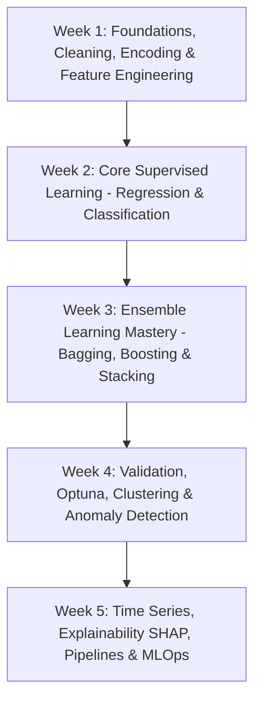

# Pure Machine Learning: 4–5 Week Accelerated Mastery Schedule (No DL / No NLP)

An intensive, structured **4–5 Week Pure Machine Learning Track** (No Deep Learning / No NLP) covering the mathematical foundations, tabular data wrangling, feature engineering, tree-based models, bagging, boosting, stacking, model interpretability (XAI), and production MLOps.

---

## 🗺️ 5-Week Master Roadmap



---

## 📅 Daily Day-by-Day Schedule (5 Weeks)

---

### 🟢 WEEK 1: Foundations, Data Cleaning & Feature Preprocessing

| Day | Topic & Core Focus | Concepts & Scikit-Learn Tools |
| :--- | :--- | :--- |
| **Day 1 (Mon)** | **Math & Stats for Machine Learning** | Vectors, matrices, gradients ($\nabla$), distributions (Gaussian, $t$, Chi-square), CLT, $p$-values, $t$-tests, correlation. |
| **Day 2 (Tue)** | **NumPy Vectorization & Pandas Wrangling** | Vectorized computations vs. loops, broadcasting, groupby, pivot tables, downcasting numeric types for memory optimization. |
| **Day 3 (Wed)** | **EDA & Data Cleaning (Missing Data & Outliers)** | Skewness, correlation heatmaps, MCAR/MAR/MNAR missing mechanisms, KNN/MICE Imputation, IQR ($1.5 \times \text{IQR}$) & Z-score outlier capping. |
| **Day 4 (Thu)** | **Categorical Encoding & Feature Scaling** | One-Hot, Ordinal, Target/Mean Encoding (with out-of-fold regularization), `StandardScaler`, `RobustScaler`, `PowerTransformer`. |
| **Day 5 (Fri)** | **Feature Engineering & Feature Selection** | Domain interaction features ($x_1 \times x_2$, ratios), cyclical time transforms (sin/cos), RFE, Mutual Information, Lasso selection. |
| 🧪 **Weekend 1** | **Capstone Project 1** | **Automated Tabular Data Audit & Preprocessing Pipeline** (End-to-end cleaning, encoding, and scaling pipeline). |

---

### 🔵 WEEK 2: Core Supervised Learning (Regression & Classification)

| Day | Topic & Core Focus | Concepts & Scikit-Learn Tools |
| :--- | :--- | :--- |
| **Day 6 (Mon)** | **Linear Regression & Optimization** | OLS math, Gradient Descent (Batch, SGD, Mini-batch), learning rate schedules, VIF multicollinearity test, `LinearRegression`. |
| **Day 7 (Tue)** | **Regularization & Non-Linear Regression** | Bias-Variance tradeoff, Ridge (L2), Lasso (L1 sparsity), ElasticNet, Polynomial regression, SVR with RBF kernel, $k$-NN Regressor. |
| **Day 8 (Wed)** | **Logistic Regression & Probabilistic Modeling** | Sigmoid function, Log-Odds (Logit), Maximum Likelihood Estimation (MLE), Binary Cross-Entropy / Log-Loss, threshold tuning. |
| **Day 9 (Thu)** | **Classification Metrics & Imbalanced Data** | Precision, Recall, $F_1$, ROC-AUC, PR-AUC, Brier score, SMOTE, ADASYN, `class_weight='balanced'`. |
| **Day 10 (Fri)** | **Decision Trees (CART) & Support Vector Machines** | Gini Impurity vs. Information Gain / Entropy, Cost-Complexity Pruning (`ccp_alpha`), SVM maximum margin hyperplane, RBF kernel trick. |
| 🧪 **Weekend 2** | **Capstone Project 2** | **Credit Risk & Loan Default Prediction Benchmark** (Benchmarking regularized linear vs. non-linear classifiers with imbalanced data). |

---

### 🔴 WEEK 3: Ensemble Learning Mastery (Bagging, Boosting & Stacking)

| Day | Topic & Core Focus | Concepts & Scikit-Learn Tools |
| :--- | :--- | :--- |
| **Day 11 (Mon)** | **Ensemble Foundations & Bagging** | Bootstrap sampling, Out-of-Bag (OOB) error estimation, variance reduction properties, `BaggingClassifier`, `BaggingRegressor`. |
| **Day 12 (Tue)** | **Random Forests & Extra Trees** | Random feature subspacing (`max_features`), decorrelating trees, Extra Trees (Extremely Randomized Trees), Mean Decrease in Impurity (MDI). |
| **Day 13 (Wed)** | **Boosting Fundamentals: AdaBoost & GBDT** | **AdaBoost** (sample reweighting, decision stumps), **GBDT** (Gradient descent in function space, pseudo-residuals, shrinkage $\eta$). |
| **Day 14 (Thu)** | **Modern SOTA Boosting: XGBoost & LightGBM** | **XGBoost** (2nd-order Taylor expansion, Hessians/Gradients, histogram binning) & **LightGBM** (GOSS, EFB, leaf-wise tree growth). |
| **Day 15 (Fri)** | **CatBoost & Multi-Level Stacking Ensembles** | **CatBoost** (ordered target stats, oblivious trees), Voting (Hard vs. Soft), Blending, Multi-Level **Stacking** with Meta-Learners. |
| 🧪 **Weekend 3** | **Capstone Project 3** | **Kaggle-Style Tabular Tournament** (Benchmarking Random Forest vs. XGBoost vs. LightGBM vs. CatBoost + Stacking ensemble). |

---

### 🟠 WEEK 4: Validation, Hyperparameter Optimization & Unsupervised Learning

| Day | Topic & Core Focus | Concepts & Scikit-Learn Tools |
| :--- | :--- | :--- |
| **Day 16 (Mon)** | **Cross-Validation Schemes & Leakage Prevention** | $K$-Fold, Stratified $K$-Fold, Group $K$-Fold, TimeSeriesSplit, wrapping models & preprocessors inside Scikit-Learn `Pipeline`. |
| **Day 17 (Tue)** | **Hyperparameter Optimization with Optuna** | GridSearch vs. RandomSearch vs. Bayesian Optimization (TPE), automated trial pruning (Median / Hyperband) with **Optuna**. |
| **Day 18 (Wed)** | **Clustering Algorithms** | $K$-Means & $K$-Means++, Elbow method, Silhouette analysis, Hierarchical Agglomerative clustering (Dendrograms), Gaussian Mixture Models (GMM). |
| **Day 19 (Thu)** | **DBSCAN & Anomaly Detection** | DBSCAN (density-based clustering, noise handling), **Isolation Forest** (tree isolation path lengths), **Local Outlier Factor (LOF)**, One-Class SVM. |
| **Day 20 (Fri)** | **Dimensionality Reduction & Manifold Learning** | PCA (Singular Value Decomposition, scree plots), Linear Discriminant Analysis (LDA), t-SNE & UMAP for 2D/3D visualizations. |
| 🧪 **Weekend 4** | **Capstone Project 4** | **Customer Segmentation & Fraud Anomaly Engine** (Unsupervised customer clustering + Outlier detection + Optuna-tuned tree classifier). |

---

### 🟣 WEEK 5: Advanced Tabular ML, Explainability & Production MLOps

| Day | Topic & Core Focus | Concepts & Scikit-Learn Tools |
| :--- | :--- | :--- |
| **Day 21 (Mon)** | **Tabular Time Series Forecasting** | Stationarity, ADF test, ARIMA, transforming time series to tabular ML with lag features ($y_{t-1}, y_{t-7}$) and rolling statistics with LightGBM. |
| **Day 22 (Tue)** | **Explainable AI (XAI) with SHAP & LIME** | Cooperative game theory, **TreeSHAP** (summary, waterfall, dependence plots), LIME local explanations, Partial Dependence Plots (PDP) & ICE curves. |
| **Day 23 (Wed)** | **Recommender Systems (Pure ML)** | Collaborative Filtering (User-User, Item-Item), Matrix Factorization (SVD, ALS), Content-Based Filtering, Precision@k & NDCG. |
| **Day 24 (Thu)** | **Custom Scikit-Learn Transformers & Pipelines** | Subclassing `BaseEstimator` & `TransformerMixin`, building robust custom transformers, assembling full raw-data-to-prediction pipelines. |
| **Day 25 (Fri)** | **Production MLOps: FastAPI, Streamlit, Docker & Drift** | Model serialization (`joblib`, ONNX), building REST APIs with **FastAPI**, creating UI with **Streamlit**, **Docker** containerization, Data Drift monitoring (KS-test / PSI). |
| 🧪 **Weekend 5** | **Final Capstone Portfolio Project** | **End-to-End Production ML Service** (Trained SOTA Ensemble + SHAP Explainability Dashboard + FastAPI REST API + Dockerized Container). |

---

## ⏱️ Daily Routine (1.5 - 2 Hours / Day)

```
┌─────────────────────────────────────────────────────────────┐
│ 1. Core Intuition & Mathematics (20 mins)                   │
│    - What problem does this solve?                          │
│    - What is the mathematical mechanism / loss function?    │
├─────────────────────────────────────────────────────────────┤
│ 2. Scikit-Learn & Python Hands-on Implementation (45 mins)  │
│    - Code the algorithm from scratch (where helpful)        │
│    - Train using Scikit-Learn / XGBoost / LightGBM / CatBoost│
├─────────────────────────────────────────────────────────────┤
│ 3. Hyperparameter Tuning & Diagnostic Checks (30 mins)      │
│    - Tune critical parameters                               │
│    - Inspect bias vs. variance, errors & edge cases         │
├─────────────────────────────────────────────────────────────┤
│ 4. Key Interview Pitfalls & Summary (15 mins)               │
│    - Understand common traps, leakage risks & trade-offs    │
└─────────────────────────────────────────────────────────────┘
```
