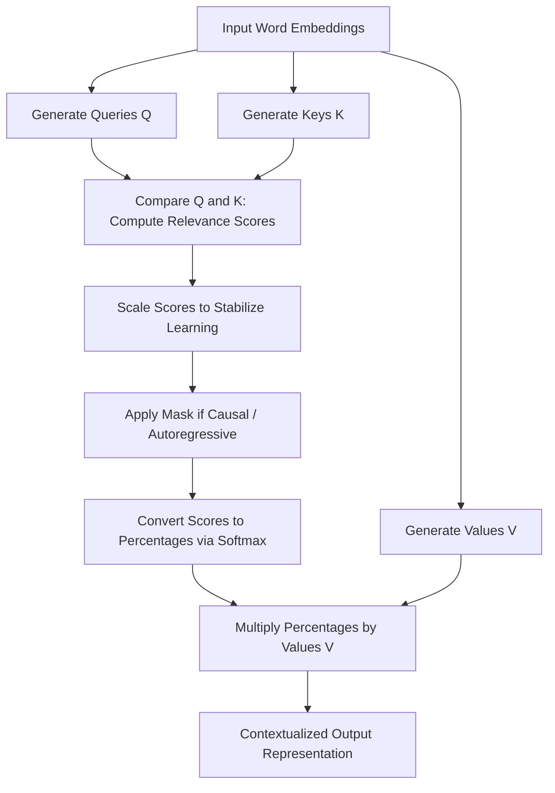

# Conceptual & Theoretical Guide: Self-Attention, Encoders, & Feed-Forward Networks

---

## Table of Contents
1. [The Big Picture: The Transformer Architecture](#1-the-big-picture-the-transformer-architecture)
2. [Self-Attention Layer: Inter-Token Communication](#2-self-attention-layer-inter-token-communication)
   - [Why Attention? Overcoming RNN Limitations](#why-attention-overcoming-rnn-limitations)
   - [The Database Metaphor: Queries, Keys, and Values](#the-database-metaphor-queries-keys-and-values)
   - [How Self-Attention Works (Step-by-Step Flow)](#how-self-attention-works-step-by-step-flow)
   - [Why Do We Scale Attention Scores? (Intuitive Explanation)](#why-do-we-scale-attention-scores-intuitive-explanation)
   - [Multi-Head Attention: Looking from Multiple Angles](#multi-head-attention-looking-from-multiple-angles)
   - [Positional Encodings: Giving the Model a Sense of Order](#positional-encodings-giving-the-model-a-sense-of-order)
3. [Position-wise Feed-Forward Network (FFN): The Knowledge Engine](#3-position-wise-feed-forward-network-ffn-the-knowledge-engine)
   - [Why Do We Need an FFN if We Already Have Attention?](#why-do-we-need-an-ffn-if-we-already-have-attention)
   - [FFN as an Associative Memory Store](#ffn-as-an-associative-memory-store)
   - [How the FFN Operates (Expansion & Compression)](#how-the-ffn-operates-expansion--compression)
   - [Evolution of Activation Functions (ReLU → GELU → SwiGLU)](#evolution-of-activation-functions-relu--gelu--swiglu)
4. [The Transformer Encoder: Contextual Understanding](#4-the-transformer-encoder-contextual-understanding)
   - [The Purpose of the Encoder](#the-purpose-of-the-encoder)
   - [Anatomy of an Encoder Layer](#anatomy-of-an-encoder-layer)
   - [Residual (Skip) Connections: Highway for Gradients](#residual-skip-connections-highway-for-gradients)
   - [Layer Normalization: Keeping Values Stable](#layer-normalization-keeping-values-stable)
   - [Stacking Multiple Encoder Layers (Deep Feature Hierarchy)](#stacking-multiple-encoder-layers-deep-feature-hierarchy)
5. [Architectural Styles: Encoder-Only vs. Decoder-Only vs. Encoder-Decoder](#5-architectural-styles-encoder-only-vs-decoder-only-vs-encoder-decoder)
6. [Attention Variants & Modern Innovations](#6-attention-variants--modern-innovations)
   - [Bidirectional vs. Causal (Masked) Attention](#bidirectional-vs-causal-masked-attention)
   - [Cross-Attention: Connecting Two Different Sequences](#cross-attention-connecting-two-different-sequences)
   - [Memory Optimizations: MHA vs. MQA vs. GQA](#memory-optimizations-mha-vs-mqa-vs-gqa)
   - [FlashAttention: GPU Hardware Optimization](#flashattention-gpu-hardware-optimization)
7. [Clean PyTorch Implementation](#7-clean-pytorch-implementation)
8. [Summary Cheat Sheet](#8-summary-cheat-sheet)

---

## 1. The Big Picture: The Transformer Architecture

In human language, words cannot be understood in isolation. The meaning of a word depends entirely on the words around it.

Before Transformers, deep learning models (RNNs and LSTMs) read text word-by-word like a tape recorder. This had two major flaws:
1. **Forgetfulness:** By the time the model reached the end of a long sentence, it had already forgotten details from the beginning.
2. **Speed Bottlenecks:** Because each word depended on the previous one, GPUs could not process words in parallel.

The **Transformer** replaced sequential steps with two complementary mechanisms inside each layer:
1. **Self-Attention Sublayer:** Gathers context by allowing every word to look at and communicate with every other word across the entire sentence simultaneously.
2. **Feed-Forward Sublayer (FFN):** Processes each word individually, applying deep non-linear reasoning and pulling facts from memorized knowledge.

```
┌────────────────────────────────────────────────────────────────────────┐
│                        TRANSFORMER ENCODER BLOCK                       │
│                                                                        │
│   Input: Sentence of word embeddings                                   │
│                                                                        │
│   1. Multi-Head Self-Attention ──> "Mix information ACROSS words"      │
│   2. Add & Layer Normalization                                         │
│   3. Position-wise FFN        ──> "Process & recall knowledge PER word"│
│   4. Add & Layer Normalization                                         │
│                                                                        │
│   Output: Contextualized representations (rich meaning for each word)  │
└────────────────────────────────────────────────────────────────────────┘
```

---

## 2. Self-Attention Layer: Inter-Token Communication

### Why Attention? Overcoming RNN Limitations

In an RNN, information had to travel through every intervening word step-by-step:

$$\text{Word 1} \longrightarrow \text{Word 2} \longrightarrow \text{Word 3} \longrightarrow \dots \longrightarrow \text{Word 50}$$

If Word 50 needed information from Word 1, that signal had to survive 50 recurrent transformations. Often, the signal degraded or vanished.

In **Self-Attention**, every token has a direct, instantaneous connection to every other token ($O(1)$ distance). Distance in the sentence no longer causes degradation.

---

### The Database Metaphor: Queries, Keys, and Values

To understand how attention works conceptually, imagine searching in a modern database or search engine:

```
               ┌───────────────────────┐
  Query (Q) ──>│ Compare Similarity    │<── Keys (K)
               │ (How relevant is each │
               │  word to my query?)   │
               └───────────┬───────────┘
                           │ Relevance Percentages (Sum to 100%)
                           ▼
               ┌───────────────────────┐
  Values (V) ─>│ Weighted Blend       │──> Context-Enriched Output Vector
               └───────────────────────┘
```

* **Query ($Q$):** *"What am I looking for?"*  
  Each word creates a query vector representing its current informational need.
* **Key ($K$):** *"What do I offer / What is my label?"*  
  Each word presents a key vector advertising its properties, grammatical role, or semantic meaning.
* **Value ($V$):** *"What is my actual content?"*  
  Each word holds a value vector containing its actual information to share.

---

### How Self-Attention Works (Step-by-Step Flow)



1. **Step 1 - Project:** The model takes input word vectors and linearly projects them into three separate vectors for each word: Query, Key, and Value.
2. **Step 2 - Compare:** The model compares every Query against all Keys by taking their dot product. High score = high relevance.
3. **Step 3 - Scale:** The scores are scaled down by a stabilizing factor based on vector size.
4. **Step 4 - Softmax:** Raw scores are passed through a Softmax function, converting them into attention percentages (weights between 0% and 100% that sum to 1).
5. **Step 5 - Weighted Blend:** Each word takes a weighted sum of all Values based on those percentages. The result is a new representation of the word that has absorbed context from all relevant neighbors.

> **Example:** In the sentence *"The bank by the river had muddy grass"*, the Query for *"bank"* will match strongly with the Key for *"river"*, pulling in Value information about water and geography rather than finance.

---

### Why Do We Scale Attention Scores? (Intuitive Explanation)

When vectors have hundreds of dimensions, multiplying them produces numbers that can grow very large in magnitude.

* When numbers fed into a **Softmax** function are extremely large (e.g., +50 vs -50), the output becomes almost a 100% hard spike on one item and 0% on everything else.
* In deep learning, extreme spikes cause **gradient saturation**—the slope of the learning curve flattens out to zero, effectively halting neural network training (vanishing gradients).
* **The Fix:** We divide the scores by the square root of the key dimension ($\sqrt{d_k}$) to keep the numbers in a comfortable, smooth range where gradients remain healthy and active.

---

### Multi-Head Attention: Looking from Multiple Angles

A human reading a sentence pays attention to multiple things at once:
1. *Grammar:* What is the subject of this verb?
2. *Pronoun resolution:* What does *"it"* refer to?
3. *Modifiers:* Which noun does this adjective describe?

A single attention mechanism can only focus on one blend of relationships at a time. **Multi-Head Attention** solves this by splitting the word representations into multiple independent "heads" (e.g., 8, 16, or 32 heads).

```
                            Input Word
                                │
         ┌──────────────────────┼──────────────────────┐
         ▼                      ▼                      ▼
      Head 1                 Head 2                 Head 3
 (Tracks Grammar /      (Resolves Pronouns /   (Tracks Adjectives &
   Subject-Verb)         e.g. 'it' -> 'cat')     Descriptive Context)
         │                      │                      │
         └──────────────────────┼──────────────────────┘
                                ▼
                   Combine & Project Together
                                │
                                ▼
                      Final Multi-Head Output
```

Each head learns to specialize in different types of linguistic patterns, and their combined outputs provide a rich, multi-perspective understanding.

---

### Positional Encodings: Giving the Model a Sense of Order

By default, the attention calculation does not care about word order. If you scramble the words in a sentence into a random bag of words, the raw attention mechanism treats them identically.

Because word order carries critical meaning (*"Dog bites man"* vs. *"Man bites dog"*), we add **Positional Encodings** to the word embeddings before the first attention layer.

* **Sinusoidal Positional Encoding (Original Transformer):** Uses continuous mathematical wave frequencies (sine and cosine) so the model can naturally deduce relative distances between words.
* **Rotary Position Embeddings (RoPE - LLaMA, Mistral, Gemma):** Rotates the Query and Key vectors in high-dimensional space based on their position, allowing the model to naturally generalize to long text sequences.

---

## 3. Position-wise Feed-Forward Network (FFN): The Knowledge Engine

### Why Do We Need an FFN if We Already Have Attention?

A common question is: *If self-attention is so powerful, why does every Transformer block also need a Feed-Forward Network?*

* **Self-Attention** is purely a **communication and routing system**. It collects and redistributes information between tokens, but it does not perform deep non-linear transformations on individual token features.
* **Feed-Forward Networks (FFN)** process each token **individually and deeply**. While attention asks *"Who should I talk to?"*, the FFN asks *"What does this combined information mean, and what facts do I know about it?"*

```
   ┌─────────────────────────────────────────────────────────────┐
   │ Self-Attention: Gathers context from other words in prompt  │
   │                              │                              │
   │                              ▼                              │
   │ Feed-Forward Network: Retrieves memorized knowledge & facts │
   └─────────────────────────────────────────────────────────────┘
```

---

### FFN as an Associative Memory Store

Research into the inner workings of Transformers shows that the FFN sublayer functions as a **Key-Value Associative Memory**:

1. **First FFN Layer (Pattern Detector / Keys):**
   Contains thousands of neurons that activate when specific concepts or patterns appear in the token's representation (e.g., detecting that the token is talking about *"the capital of France"* or a *"coding syntax error"*).
2. **Activation Gate:**
   Acts as a filter to selectively trigger only the concepts that match.
3. **Second FFN Layer (Knowledge Injector / Values):**
   Adds the corresponding factual knowledge or semantic meaning back into the token (e.g., injecting the concept of *"Paris"*).

---

### How the FFN Operates (Expansion & Compression)

The FFN is called **"position-wise"** because it applies the exact same neural network to every token position independently and identically:

```
Token Embedding (d_model = 768)
       │
       ▼  [ Expansion Layer ]
Expanded Representation (d_ff = 3072, 4x wider)
       │
       ▼  [ Non-linear Activation: GELU / SwiGLU ]
Filtered Concepts
       │
       ▼  [ Compression Layer ]
Output Representation (d_model = 768)
```

1. **Expansion:** It first expands the token's dimension by **$4\times$** (e.g., from 768 dimensions to 3,072 dimensions, or from 4,096 to 14,336). This wide layer gives the network a large workspace to unpack complex concepts.
2. **Non-linear Activation:** Passes through an activation function to filter and make non-linear decisions.
3. **Compression:** Projects the dimensions back down to the original model dimension ($d_{model}$) so it can be passed to the next block.

---

### Evolution of Activation Functions (ReLU → GELU → SwiGLU)

```
  1. ReLU (2017)           2. GELU (2018 - BERT/GPT)       3. SwiGLU (2020+ Modern LLMs)
  ─────────────────        ──────────────────────────      ─────────────────────────────
  - Hard cutoff at 0       - Smooth, continuous curve      - Gated dual-path network
  - Zeros out negatives    - Allows small negative signal   - One path gates the other
  - Can cause dead neurons - Standard in GPT-2 / GPT-3     - Used in LLaMA, Mistral, Gemma
```

* **ReLU:** Simple threshold. If input is negative, output is 0.
* **GELU (Gaussian Error Linear Unit):** A smooth curve that probabilistically scales inputs, avoiding harsh dead zones.
* **SwiGLU (Swish Gated Linear Unit):** Splits the computation into two parallel pathways and multiplies them element-by-element. This gating mechanism allows the network to dynamically control information flow with high precision.

---

## 4. The Transformer Encoder: Contextual Understanding

### The Purpose of the Encoder

The goal of a **Transformer Encoder** is to take a sequence of isolated, ambiguous word tokens and produce a sequence of **deeply contextualized representations**.

```
Input Tokens:     "apple"                           "apple"
Context:       "I bought an apple at the store"   "Apple released the new iPhone"
                     │                                  │
Encoder Output: [ Coordinate for Fruit ]           [ Coordinate for Tech Company ]
```

Because the Encoder has **bidirectional visibility**, every word can look both forward to future words and backward to past words to determine its exact contextual meaning.

---

### Anatomy of an Encoder Layer

Each Encoder layer contains **two sub-layers** wrapped with **Residual (Skip) Connections** and **Layer Normalization**:

```
                       Input Token Vectors
                               │
            ┌──────────────────┴──────────────────┐
            │                                     │
            ▼                                     │ (Residual Highway)
    [ Multi-Head Self-Attention ]                 │
    (Bidirectional - looks all directions)        │
            │                                     │
            ▼                                     │
         ( Add ) <────────────────────────────────┘
            │
            ▼
    [ Layer Normalization ]
            │
            ├─────────────────────────────────────┐
            │                                     │ (Residual Highway)
            ▼                                     │
    [ Position-wise FFN ]                         │
    (Recalls facts & transforms features)         │
            │                                     │
            ▼                                     │
         ( Add ) <────────────────────────────────┘
            │
            ▼
    [ Layer Normalization ]
            │
            ▼
         Output to Next Encoder Layer
```

---

### Residual (Skip) Connections: Highway for Gradients

Without residual connections, signals passing through 20 or 30 layers of deep neural networks degrade, and training fails due to vanishing gradients.

* A **Residual Connection** takes the input before a sublayer and adds it directly to the output of that sublayer:
  $$\text{Output} = \text{Input} + \text{Sublayer}(\text{Input})$$
* **Why it works:** It creates an uninterrupted gradient highway straight back to the first layer. If a sublayer learns nothing useful, it can simply output zero, and the original input passes through untouched without information loss.

---

### Layer Normalization: Keeping Values Stable

In deep networks, activations can fluctuate wildly—some becoming too large and others too small.

* **Layer Normalization** rescales the activations across the feature dimensions for each individual token, ensuring values maintain a stable mean and variance.
* **Pre-LN vs. Post-LN:**
  * *Post-LN (Original 2017):* Normalized after the addition. Prone to instability in deep networks.
  * *Pre-LN (Modern Standard):* Normalizes inputs **before** feeding them to the attention or FFN sublayers. Allows training of very deep models without unstable warmups.
  * *RMSNorm (LLaMA/Gemma):* A faster version of LayerNorm that normalizes using only the root-mean-square, eliminating the mean calculation to speed up computation.

---

### Stacking Multiple Encoder Layers (Deep Feature Hierarchy)

When you stack 12 or 24 Encoder layers on top of each other, the model develops a hierarchical understanding of language:

```
  Top Layers (Layers 9-12):     Complex semantics, high-level reasoning, overall topic
             ▲
  Middle Layers (Layers 5-8):   Grammatical clauses, sentence structure, coreferences
             ▲
  Bottom Layers (Layers 1-4):   Surface-level word identity, local parts of speech
```

---

## 5. Architectural Styles: Encoder-Only vs. Decoder-Only vs. Encoder-Decoder

```
               ENCODER-ONLY                   DECODER-ONLY                    ENCODER-DECODER
             (e.g., BERT, RoBERTa)          (e.g., GPT, LLaMA)              (e.g., T5, BART, Original)

  Attention:   Bidirectional (Full)          Causal (Look-back only)         Both (Enc: Full, Dec: Causal + Cross)
  Masking:     None                          Strict Look-Back Mask           Encoder: None; Decoder: Look-Back
  Superpower:  Understanding & Analysis      Text Generation & Reasoning     Translation & Transformation
```

| Architecture Type | Attention Type | Primary Superpower | Best Used For | Classic Examples |
| :--- | :--- | :--- | :--- | :--- |
| **Encoder-Only** | Bidirectional (words see left and right) | Deep understanding and feature extraction | Search embeddings, text classification, sentiment analysis, named entity recognition | BERT, RoBERTa, DeBERTa |
| **Decoder-Only** | Causal (words can only see the past) | Fluid next-token prediction and generative reasoning | Chatbots, code generation, creative writing, autonomous agents | GPT-4, LLaMA 3, Mistral, Claude |
| **Encoder-Decoder** | Bidirectional in Encoder; Causal & Cross-Attention in Decoder | Translating from one distinct sequence into another | Language translation, document summarization, speech-to-text | T5, BART, Whisper |

---

## 6. Attention Variants & Modern Innovations

### Bidirectional vs. Causal (Masked) Attention

```
Bidirectional Attention (Encoders)            Causal / Masked Attention (Decoders)
Every word can see every other word.          Words can ONLY see previous and current words.

       Word1  Word2  Word3  Word4                    Word1  Word2  Word3  Word4
Word1 [  ✓      ✓      ✓      ✓   ]           Word1 [  ✓      ✗      ✗      ✗   ]
Word2 [  ✓      ✓      ✓      ✓   ]           Word2 [  ✓      ✓      ✗      ✗   ]
Word3 [  ✓      ✓      ✓      ✓   ]           Word3 [  ✓      ✓      ✓      ✗   ]
Word4 [  ✓      ✓      ✓      ✓   ]           Word4 [  ✓      ✓      ✓      ✓   ]
```

* **Why Causal Masking is needed for generation:** When training an LLM to predict the next word, it cannot be allowed to "cheat" by looking at future words. We mask out the future tokens so it only generates based on the past.

---

### Cross-Attention: Connecting Two Different Sequences

In translation models (like English to Spanish):
* The **Queries ($Q$)** come from the Spanish translation being generated in the Decoder.
* The **Keys ($K$)** and **Values ($V$)** come from the English source text processed by the Encoder.
* This allows the generator to look back at the original source material at every step.

---

### Memory Optimizations: MHA vs. MQA vs. GQA

During generation, storing past Keys and Values (**KV Cache**) in GPU memory is the primary bottleneck for serving long conversations.

```
  Multi-Head Attention (MHA)       Multi-Query Attention (MQA)      Grouped-Query Attention (GQA)
      (Standard Transformer)              (Extreme Savings)              (Modern Standard - Llama 3)

    Q1  Q2  Q3  Q4  Q5  Q6  Q7  Q8        Q1  Q2  Q3  Q4  Q5  Q6  Q7  Q8        Q1  Q2  Q3  Q4  Q5  Q6  Q7  Q8
    │   │   │   │   │   │   │   │         \   \   \   \   /   /   /   /         \   /   \   /   \   /   \   / 
    K1  K2  K3  K4  K5  K6  K7  K8              K1 (Shared)                           K1      K2      K3      K4
    V1  V2  V3  V4  V5  V6  V7  V8              V1 (Shared)                           V1      V2      V3      V4
```

1. **Multi-Head Attention (MHA):** 1 Key/Value head per Query head. Rich representations, but heavy memory usage.
2. **Multi-Query Attention (MQA):** All Query heads share a single Key and Value head. Minimal memory, but slight quality drop.
3. **Grouped-Query Attention (GQA):** Query heads are grouped together, and each group shares 1 Key/Value head. **The modern sweet spot** used in LLaMA 3, Mistral, and Gemma.

---

### FlashAttention: GPU Hardware Optimization

Standard attention writes huge intermediate tables of numbers to the GPU's slower main memory (High Bandwidth Memory). 

**FlashAttention** divides the computation into smaller tiles that fit directly into the GPU's ultra-fast on-chip cache (SRAM), computing attention on-the-fly without saving massive tables to memory.
* **Result:** $2\times$ to $4\times$ faster execution with massive memory savings and **zero loss in accuracy**.

---

## 7. Clean PyTorch Implementation

Here is a clear, self-contained implementation of a complete **Transformer Encoder Layer** using PyTorch:

```python
import torch
import torch.nn as nn
import torch.nn.functional as F
import math

class MultiHeadSelfAttention(nn.Module):
    """
    Splits representations into multiple heads to look at
    context from different perspectives simultaneously.
    """
    def __init__(self, d_model: int, num_heads: int):
        super().__init__()
        self.d_model = d_model
        self.num_heads = num_heads
        self.head_dim = d_model // num_heads
        
        # Linear projections for Queries, Keys, and Values
        self.q_proj = nn.Linear(d_model, d_model)
        self.k_proj = nn.Linear(d_model, d_model)
        self.v_proj = nn.Linear(d_model, d_model)
        self.out_proj = nn.Linear(d_model, d_model)
        
    def forward(self, x: torch.Tensor, mask: torch.Tensor = None):
        batch_size, seq_len, _ = x.shape
        
        # 1. Project to Q, K, V and split into heads
        Q = self.q_proj(x).view(batch_size, seq_len, self.num_heads, self.head_dim).transpose(1, 2)
        K = self.k_proj(x).view(batch_size, seq_len, self.num_heads, self.head_dim).transpose(1, 2)
        V = self.v_proj(x).view(batch_size, seq_len, self.num_heads, self.head_dim).transpose(1, 2)
        
        # 2. Compare Queries and Keys (Dot-product similarity)
        scores = torch.matmul(Q, K.transpose(-2, -1))
        
        # 3. Scale scores to prevent vanishing gradients
        scores = scores / math.sqrt(self.head_dim)
        
        # 4. Optional masking (e.g. padding mask or causal mask)
        if mask is not None:
            scores = scores.masked_fill(mask == 0, -1e9)
            
        # 5. Convert scores to attention percentages
        attn_weights = F.softmax(scores, dim=-1)
        
        # 6. Weighted blend of Value vectors
        context = torch.matmul(attn_weights, V)
        
        # 7. Concatenate all heads back together and project
        context = context.transpose(1, 2).contiguous().view(batch_size, seq_len, self.d_model)
        return self.out_proj(context)


class PositionwiseFeedForward(nn.Module):
    """
    Processes each word individually:
    Expands representation (4x) -> Applies Non-Linearity (GELU) -> Compresses back.
    """
    def __init__(self, d_model: int, d_ff: int):
        super().__init__()
        self.linear1 = nn.Linear(d_model, d_ff)
        self.activation = nn.GELU()
        self.linear2 = nn.Linear(d_ff, d_model)
        
    def forward(self, x: torch.Tensor) -> torch.Tensor:
        return self.linear2(self.activation(self.linear1(x)))


class TransformerEncoderLayer(nn.Module):
    """
    A Complete Modern Encoder Block (Pre-LN):
    Input -> LayerNorm -> Self-Attention -> Residual Add
          -> LayerNorm -> FFN            -> Residual Add
    """
    def __init__(self, d_model: int, num_heads: int, d_ff: int):
        super().__init__()
        self.self_attn = MultiHeadSelfAttention(d_model, num_heads)
        self.ffn = PositionwiseFeedForward(d_model, d_ff)
        
        self.norm1 = nn.LayerNorm(d_model)
        self.norm2 = nn.LayerNorm(d_model)
        
    def forward(self, x: torch.Tensor, mask: torch.Tensor = None) -> torch.Tensor:
        # Sublayer 1: Self-Attention with Pre-LN Residual Connection
        normed_x = self.norm1(x)
        x = x + self.self_attn(normed_x, mask=mask)
        
        # Sublayer 2: Feed-Forward Network with Pre-LN Residual Connection
        normed_x = self.norm2(x)
        x = x + self.ffn(normed_x)
        
        return x


# Quick Demonstration:
if __name__ == "__main__":
    batch_size = 2
    sequence_length = 8
    embedding_dim = 512
    num_heads = 8
    ffn_hidden_dim = 2048  # 4x expansion
    
    # Simulated input of word embeddings
    tokens = torch.randn(batch_size, sequence_length, embedding_dim)
    
    encoder = TransformerEncoderLayer(embedding_dim, num_heads, ffn_hidden_dim)
    output = encoder(tokens)
    
    print(f"Input shape:  {tokens.shape}")
    print(f"Output shape: {output.shape}")
    print("Encoder layer processed all tokens with full contextual attention successfully!")
```

---

## 8. Summary Cheat Sheet

| Component | Role in the Network | Real-World Analogy | Key Takeaway |
| :--- | :--- | :--- | :--- |
| **Self-Attention** | **Inter-token communication:** Lets every word read and pull context from every other word in the sequence. | A roundtable discussion where every participant listens to everyone else. | Provides global context in a single step with direct $O(1)$ connections. |
| **Queries ($Q$)** | Represents what a word is actively looking for. | Search query in Google. | Used to compute relevance scores against Keys. |
| **Keys ($K$)** | Represents the tags/labels that a word offers. | Web page titles / SEO tags. | Matched against Queries to determine attention weight. |
| **Values ($V$)** | Represents the actual semantic content of the word. | The text content of the web page. | Blended together based on attention weights. |
| **Multi-Head Attention** | Runs multiple attention processes in parallel. | Having a team of specialists analyzing a sentence for grammar, tone, and logic. | Captures diverse linguistic and factual relationships simultaneously. |
| **Feed-Forward (FFN)** | **Knowledge retrieval & non-linear transformation:** Processes each token individually and deeply. | A reference library / factual memory bank. | Expands dimensions by $4\times$ to retrieve facts and apply non-linear logic. |
| **Residual (Skip) Connections** | Adds the sublayer input directly to its output ($x + \text{Sublayer}(x)$). | A highway bypass around local traffic. | Prevents vanishing gradients, allowing models to be stacked dozens of layers deep. |
| **Layer Normalization** | Rescales numbers across features to maintain consistent mean and variance. | A voltage regulator keeping electrical power steady. | Prevents activations from exploding or collapsing during deep training. |
| **Transformer Encoder** | Stacks $N$ encoder layers to produce rich contextual embeddings. | A comprehensive reading and comprehension engine. | Bidirectional—gives each word a rich, 360-degree understanding of the whole text. |
