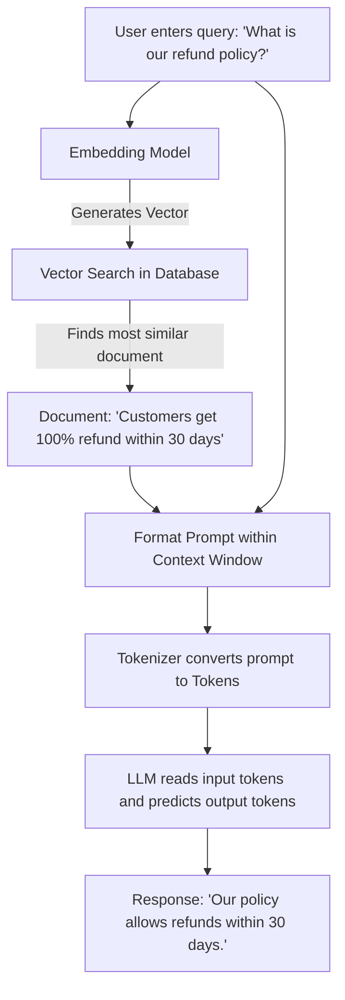

# Core AI Concepts: LLMs, Tokens, Embeddings, & Context Windows

This document provides a comprehensive explanation of the fundamental building blocks of modern Generative AI and Large Language Models (LLMs). Understanding these four concepts—**LLMs**, **Tokens**, **Embeddings**, and **Context Windows**—is essential for building application pipelines (like RAG, chatbots, or agents) and working with AI APIs.

---

## Table of Contents
1. [Large Language Models (LLMs)](#1-large-language-models-llms)
2. [Tokens (The Vocabulary of AI)](#2-tokens-the-vocabulary-of-ai)
3. [Embeddings (The Meaning of Words in Math)](#3-embeddings-the-meaning-of-words-in-math)
4. [Context Windows (The AI's Short-Term Memory)](#4-context-windows-the-ais-short-term-memory)
5. [How They All Fit Together (An End-to-End Example)](#5-how-they-all-fit-together-an-end-to-end-example)
6. [Summary Comparison](#6-summary-comparison)

---

## 1. Large Language Models (LLMs)

### What is an LLM?
A **Large Language Model (LLM)** is a type of artificial intelligence trained on massive amounts of text data to understand, generate, and manipulate human language. 

At its absolute core, an LLM is a **highly advanced next-token prediction engine**. 
Given a prompt (e.g., *"The cat sat on the..."*), the model calculates the mathematical probability of every word in its vocabulary and predicts the most likely next word (e.g., *"mat"* or *"carpet"*).

```
   [ Input Prompt ] ──> [ LLM (Neural Network / Transformer) ] ──> [ Next-Word Probability ]
 "The cat sat on the"                                                 "mat" (92%)
                                                                      "sofa" (5%)
                                                                      "moon" (0.01%)
```

### How Do They Work?
* **The Transformer Architecture:** Modern LLMs (like GPT-4, Gemini, Claude, and Llama) are built on the **Transformer** neural network architecture, introduced by Google researchers in 2017. The key innovation is the **Self-Attention mechanism**, which allows the model to look at every word in a sentence and decide which other words are most relevant to it, regardless of how far apart they are.
* **Pre-training:** The model reads billions of pages from the internet, books, and articles. It learns the structure of grammar, facts about the world, reasoning skills, and even programming languages by repeatedly trying to guess the hidden words in text.
* **Fine-Tuning & Alignment (RLHF):** Raw models are just text-completers. To make them useful assistants, they undergo **Reinforcement Learning from Human Feedback (RLHF)** or instruction-tuning. This aligns their behavior to follow instructions, avoid harmful outputs, and adopt a conversational tone.

---

## 2. Tokens (The Vocabulary of AI)

### What is a Token?
Before an LLM can process text, the text must be broken down into smaller pieces. These pieces are called **tokens**. 
* A token is the basic unit of data processed by an LLM.
* Tokens are **not** always whole words. They can be whole words, parts of words (sub-words), individual characters, or even punctuation marks.

```
Example sentence: "Tokenization is helpful."
Tokens:          ["Token", "ization", " is", " help", "ful", "."]
```

### Why Do LLMs Use Tokens Instead of Words?
1. **Handling Unknown Words:** If a model only recognized whole words, it would fail when encountering a new word or a misspelling. Sub-word tokenization allows the model to construct unknown words from known pieces (e.g., recognizing `"unbelievable"` as `["un", "believ", "able"]`).
2. **Efficiency:** Breaking text down into sub-words reduces the size of the model's vocabulary list from millions of unique words to a manageable size (typically around 30,000 to 100,000 tokens).

### The "Rules of Thumb" for Tokens (English)
* **1 token** $\approx$ **4 characters** of English text.
* **1 token** $\approx$ **0.75 words** of English text.
* **100 tokens** $\approx$ **75 words**.
* For non-English languages, characters/words often require significantly more tokens because the tokenizers are primarily optimized for English text patterns.

### Why Tokens Matter in Practice:
* **Cost:** Almost all AI APIs (like OpenAI, Anthropic, or Google Gemini) charge you based on the number of tokens you send (Input) and receive (Output).
* **Limits:** Models have strict limits on how many tokens they can process at once (see *Context Windows* below).

---

## 3. Embeddings (The Meaning of Words in Math)

### What is an Embedding?
Computers cannot understand the "meaning" of text, but they are great at math. An **embedding** is a way of translating text (words, sentences, or entire documents) into a list of numbers (a mathematical **vector**).

An embedding represents the **semantic meaning** of text. Text snippets with similar meanings are represented by numbers that are mathematically close to each other.

```
Text: "king"    ───> [ 0.25, -0.47, 0.88, ... 1536 dimensions ... ]
Text: "queen"   ───> [ 0.23, -0.45, 0.85, ... 1536 dimensions ... ]
Text: "banana"  ───> [-0.89,  0.12, -0.05, ... 1536 dimensions ... ]
```
*Notice how the vectors for "king" and "queen" are very similar, while the vector for "banana" is completely different.*

### The High-Dimensional Vector Space
Imagine plotting words on a map. On a simple 2D map, you could group words by two concepts: "Fruity" (Y-axis) and "Sweet" (X-axis). 
* An apple would be high on both. 
* A steak would be low on both.
* A lemon would be high on Fruity but low on Sweet.

LLMs use **high-dimensional spaces** (often 768, 1,536, or even 3,072 dimensions) to capture thousands of nuanced concepts simultaneously (gender, tense, category, sentiment, etc.).

```
           [ Fruity ] ↑
                      │  Apple
                      │
                      │           [ Sweet ]
    ──────────────────┼───────────────►
             Lemon    │
                      │  Steak
                      │
```

### Key Operations with Embeddings:
* **Cosine Similarity:** A mathematical calculation that measures the angle between two vectors. A smaller angle (closer to 1.0) means the texts are semantically very similar, regardless of whether they use the exact same words.
  * *"How old are you?"* and *"What is your age?"* will have very high similarity.
* **Vector Databases:** Tools like Pinecone, Chroma, or pgvector store these embedding vectors so you can perform fast semantic searches over millions of documents. This is the foundation of **RAG (Retrieval-Augmented Generation)**.

---

## 4. Context Windows (The AI's Short-Term Memory)

### What is a Context Window?
The **Context Window** is the maximum amount of text (measured in tokens) that an LLM can read and process at a single time during a single prompt/response cycle. 

You can think of it as the model's **active, short-term memory**.

* **Input tokens:** The prompt, system instructions, and chat history.
* **Output tokens:** The response generated by the model.
* **Total Context Window:** Input Tokens + Output Tokens must be less than or equal to the model's maximum context limit.

```
┌─────────────────────────────────────────────────────────────┐
│                       CONTEXT WINDOW                        │
│ ┌───────────────────────────┐   ┌─────────────────────────┐ │
│ │ Input:                    │   │ Output:                 │ │
│ │ - System Prompt           │ + │ - Model's Response      │ │
│ │ - Chat History (Memory)   │   │                         │ │
│ │ - Uploaded Files/Docs     │   │                         │ │
│ └───────────────────────────┘   └─────────────────────────┘ │
└─────────────────────────────────────────────────────────────┘
  ◄─────────────────── Maximum Capacity ─────────────────────►
```

### Why is the Context Window Limited?
In the standard Transformer architecture, the processing cost scales quadratically ($O(N^2)$) with the length of the input. If you double the input length, the computation and memory needed to process it increases by **four times**. 

### Evolution of Context Windows
Context windows have expanded drastically in recent years:
* **GPT-3 (2020):** 2,048 tokens (~1,500 words)
* **GPT-4 (2023):** 8,192 to 32,768 tokens
* **Claude 3 (2024):** 200,000 tokens (roughly a full-length novel)
* **Gemini 1.5 Pro (2024):** up to 2,000,000 tokens (hours of video, entire codebases, or millions of words)
* **Gemini 3.5 Flash:** 1,048,576 tokens (1M tokens)
* **Gemini 3.5 Pro:** up to 2,000,000 tokens (2M tokens)


### What Happens Outside the Context Window?
Once the conversation exceeds the context window:
1. **Forgetfulness:** The LLM cannot "see" the oldest messages in the chat.
2. **Errors:** The developer of the application must prune, summarize, or discard older messages to keep the conversation running, leading to lost context.

---

## 5. How They All Fit Together (An End-to-End Example)

Let's look at how these four concepts work together when you use a custom AI system to search your company's documents (a Retrieval-Augmented Generation / RAG system):



1. **User Input:** You type: *"What is our refund policy?"*
2. **Embedding Step:** An embedding model converts your question into a mathematical vector.
3. **Retrieval Step:** The system compares this vector against thousands of pre-saved vectors of your company's documents (using *cosine similarity*). It finds a matching paragraph: *"Customers are eligible for a 100% refund within 30 days of purchase."*
4. **Assembly (Context Window):** The system builds a prompt: *"Answer the user query based ONLY on the context: [Retrieved Paragraph]. Query: [User Query]"*. This whole package must fit into the LLM's **Context Window**.
5. **Tokenization:** A tokenizer chops this prompt into **Tokens**.
6. **Execution (LLM):** The **LLM** reads the tokens, processes the context using attention, predicts the next-best tokens, and prints out the final answer: *"You can get a full refund within 30 days of purchase."*

---

## 6. Summary Comparison

| Concept | What is it? | Unit of Measure | Real-World Analogy |
| :--- | :--- | :--- | :--- |
| **LLM** | The brain/intelligence engine. | Parameters (e.g., 8B, 70B) | The human reader/writer. |
| **Token** | The basic fragments of text. | Token Count (1 word $\approx$ 1.33 tokens) | Syllables and letters of a language. |
| **Embedding** | Mathematical representation of meaning. | Multi-dimensional Vector | Coordinates on a conceptual semantic map. |
| **Context Window** | The maximum memory capacity. | Token Limit (e.g., 128k, 1M tokens) | The size of the desk space where papers are kept open. |
