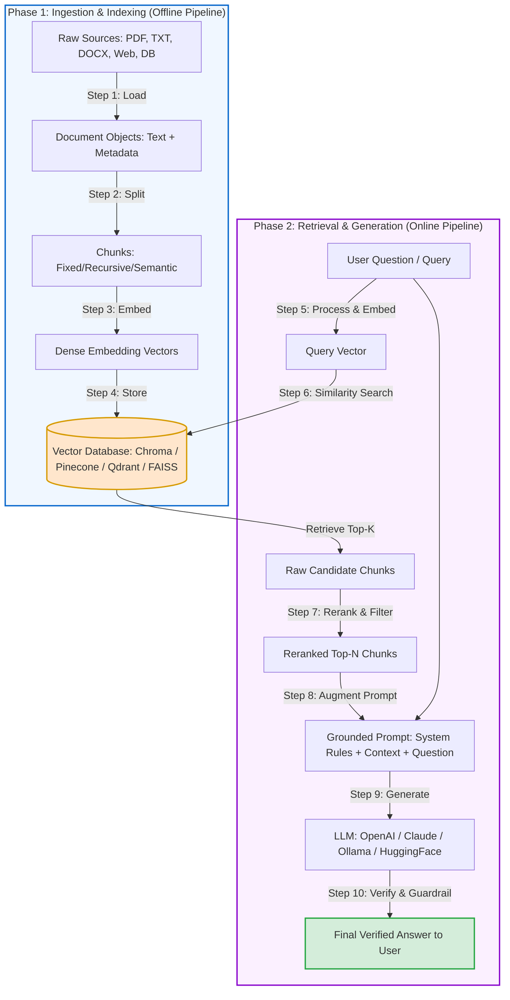
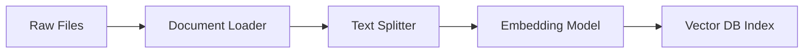

# Complete End-to-End RAG (Retrieval-Augmented Generation) Workflow Guide

Retrieval-Augmented Generation (**RAG**) is an AI architecture that enhances the capabilities of Large Language Models (LLMs) by augmenting user prompts with relevant external knowledge retrieved from a dynamic data store or vector database.

---

## 📑 Table of Contents
1. [High-Level Architecture Overview](#1-high-level-architecture-overview)
2. [End-to-End Workflow Diagram](#2-end-to-end-workflow-diagram)
3. [Phase 1: Ingestion & Indexing Pipeline (Offline/Batch)](#3-phase-1-ingestion--indexing-pipeline-offlinebatch)
   - [Step 1: Document Ingestion / Loading](#step-1-document-ingestion--loading)
   - [Step 2: Document Chunking / Text Splitting](#step-2-document-chunking--text-splitting)
   - [Step 3: Embedding Generation](#step-3-embedding-generation)
   - [Step 4: Vector Store & Indexing](#step-4-vector-store--indexing)
4. [Phase 2: Retrieval & Generation Pipeline (Online/Real-time)](#4-phase-2-retrieval--generation-pipeline-onlinereal-time)
   - [Step 5: User Query Processing & Query Embedding](#step-5-user-query-processing--query-embedding)
   - [Step 6: Similarity Search & Retrieval](#step-6-similarity-search--retrieval)
   - [Step 7: Reranking & Context Construction](#step-7-reranking--context-construction)
   - [Step 8: Prompt Augmentation](#step-8-prompt-augmentation)
   - [Step 9: LLM Inference & Generation](#step-9-llm-inference--generation)
   - [Step 10: Response Post-Processing & Guardrails](#step-10-response-post-processing--guardrails)
5. [Summary Table of All Steps](#5-summary-table-of-all-steps)
6. [Advanced RAG Enhancements](#6-advanced-rag-enhancements)
7. [Code Implementation Example (LangChain)](#7-code-implementation-example-langchain)

---

## 1. High-Level Architecture Overview

Standard LLMs face three key challenges:
- **Knowledge Cutoff**: They only know what was in their training dataset.
- **Hallucinations**: They generate plausible-sounding falsehoods when lacking context.
- **No Access to Private Data**: They cannot answer questions about private documents, enterprise knowledge bases, or real-time events.

**RAG solves this by decoupling knowledge retrieval from generation:**
```
[User Query] ──> [Retriever (Vector DB / Search)] ──> [Relevant Chunks]
                                                             │
                                                             ▼
[User Query] + [Relevant Chunks] ──> [LLM] ──> [Accurate, Grounded Answer]
```

---

## 2. End-to-End Workflow Diagram



---

## 3. Phase 1: Ingestion & Indexing Pipeline (Offline/Batch)

This pipeline converts raw, unstructured documents into searchable vector representations.



### Step 1: Document Ingestion / Loading
* **What it does:** Reads unstructured or semi-structured data from multiple source formats (`.pdf`, `.txt`, `.docx`, `.csv`, HTML, Markdown, SQL tables, APIs) and converts them into standardized `Document` objects.
* **Key Components:**
  - `page_content`: The extracted text content.
  - `metadata`: Source information such as `file_path`, `page_number`, `author`, `creation_date`, or `section_title`.
* **Why it matters:** Preserving clean metadata allows for future filtering (e.g., searching only documents created in 2025).

---

### Step 2: Document Chunking / Text Splitting
* **What it does:** Breaks down long documents into smaller, coherent segments (chunks) because:
  1. Embedding models have token context limits (e.g., 512 tokens).
  2. Granular chunks improve retrieval precision (less noise in retrieved text).
* **Chunking Strategies:**
  - **Character / Token Splitters**: Splits by fixed character count (naive).
  - **Recursive Character Splitter (Recommended)**: Splits hierarchically by `["\n\n", "\n", " ", ""]` to preserve paragraphs and sentences intact.
  - **Semantic Chunking**: Splits based on embedding similarity drops between consecutive sentences.
  - **Markdown/Code Splitters**: Splits by header structure (`#`, `##`, functions).
* **Key Parameters:**
  - `chunk_size`: Typically 400 to 1000 characters/tokens.
  - `chunk_overlap`: Typically 10–20% of `chunk_size` (e.g., 100 characters) to ensure context is not broken across chunk boundaries.

---

### Step 3: Embedding Generation
* **What it does:** Converts each text chunk into a high-dimensional dense numerical vector (e.g., 384, 768, 1536 dimensions) capturing semantic meaning.
* **How it works:** Texts with similar meanings are mapped close together in the vector space (e.g., "automobile" and "car" have high cosine similarity).
* **Popular Embedding Models:**
  - *Open Source*: `sentence-transformers/all-MiniLM-L6-v2`, `BAAI/bge-large-en-v1.5`, `nomic-embed-text`.
  - *Proprietary*: OpenAI `text-embedding-3-small`, `text-embedding-3-large`, Cohere `embed-v3`.

---

### Step 4: Vector Store & Indexing
* **What it does:** Stores embedding vectors alongside their chunk texts and metadata, indexing them for rapid Approximate Nearest Neighbor (ANN) search.
* **Indexing Algorithms:**
  - **HNSW (Hierarchical Navigable Small World)**: Graph-based, extremely fast with high recall.
  - **IVF (Inverted File Index)**: Cluster-based vector indexing.
  - **Flat / Brute Force**: Exact calculation (best for small datasets).
* **Popular Vector Databases:**
  - Local/Embedded: ChromaDB, FAISS, DuckDB.
  - Cloud/Distributed: Pinecone, Qdrant, Milvus, Weaviate, pgvector (PostgreSQL).

---

## 4. Phase 2: Retrieval & Generation Pipeline (Online/Real-time)

This pipeline executes each time a user asks a question.


### Step 5: User Query Processing & Query Embedding
* **What it does:** When a user submits a query, the system prepares the query and passes it to the **same embedding model** used during Phase 1.
* **Enhancements:**
  - **Query Rewriting / HyDE (Hypothetical Document Embeddings)**: Generates a hypothetical answer first to bridge the semantic gap between a question and an informational document.
  - **Query Expansion**: Adds synonyms or decomposed sub-queries.

---

### Step 6: Similarity Search & Retrieval
* **What it does:** Compares the query vector with stored chunk vectors in the Vector DB to find the top-$K$ most similar chunks.
* **Distance Metrics:**
  - **Cosine Similarity**: Measures the cosine of the angle between vectors (scale -1 to 1; invariant to vector magnitude).
  - **Dot Product**: Direct product of vectors (requires normalized vectors).
  - **Euclidean Distance (L2)**: Measures straight-line geometric distance.
* **Hybrid Search (Best Practice)**: Combines **Dense Vector Search** (semantic understanding) with **Sparse Lexical Search** (BM25 for exact keyword matches, SKU codes, numbers).

---

### Step 7: Reranking & Context Construction
* **What it does:** Takes the top $K$ candidates (e.g., $K=20$) from retrieval and uses a Cross-Encoder or Reranker model (e.g., Cohere Rerank, BGE-Reranker) to score them strictly against the query, keeping the top $N$ (e.g., $N=3-5$).
* **Why Reranking?** Vector search is fast but approximate; cross-encoders analyze query and chunk together with full cross-attention, drastically boosting precision and reducing noise.

---

### Step 8: Prompt Augmentation
* **What it does:** Formulates the final prompt containing:
  1. **System Persona & Rules**: Instructions to answer strictly based on context and avoid assumptions.
  2. **Retrieved Context**: The selected chunks clearly formatted with headers/delimiters.
  3. **User Question**: The original question.
* **Example Augmented Prompt Structure:**
  ```text
  You are an expert assistant. Answer the user's question ONLY based on the context provided below.
  If the context does not contain enough information, state "I do not have enough information to answer."

  --- CONTEXT START ---
  [Chunk 1: metadata: source=docs/manual.pdf, page=12]
  The cooling system operates at a maximum temperature of 95°C.

  [Chunk 2: metadata: source=docs/manual.pdf, page=13]
  If temperature exceeds 95°C, emergency shutoff initiates automatically.
  --- CONTEXT END ---

  Question: What happens if temperature reaches 100°C?
  Answer:
  ```

---

### Step 9: LLM Inference & Generation
* **What it does:** The augmented prompt is submitted to the LLM (e.g., GPT-4o, Claude 3.5 Sonnet, Llama 3.2, DeepSeek-R1).
* **Generation Settings:**
  - `temperature = 0.0 - 0.3`: Low temperature is strongly advised for RAG to minimize hallucinations and keep responses deterministic.
  - `max_tokens`: Restricts response length to avoid runaway outputs.

---

### Step 10: Response Post-Processing & Guardrails
* **What it does:** Ensures safety, accuracy, and structured formatting before returning the answer to the user.
* **Operations:**
  - **Citation Attribution**: Attaching source filenames/pages to specific claims in the response.
  - **Hallucination Detection / Faithfulness Checks**: Verifying whether claims in the generated response are grounded in the retrieved chunks (e.g., using Ragas or TruLens).
  - **Output Parsing**: Extracting structured JSON or Pydantic models when integrating into applications.

---

## 5. Summary Table of All Steps

| Step # | Stage Name | Type | Key Inputs | Key Outputs | Common Tools / Tech |
| :--- | :--- | :--- | :--- | :--- | :--- |
| **1** | **Document Loading** | Ingestion | Raw files (PDF, TXT, HTML) | LangChain `Document` objects | PyPDF, DirectoryLoader, Unstructured |
| **2** | **Text Splitting** | Ingestion | Documents | Chunks (e.g. 800 chars) | `RecursiveCharacterTextSplitter` |
| **3** | **Embedding** | Ingestion | Chunks (Text) | High-dim Vectors | HuggingFace, OpenAI, Ollama |
| **4** | **Vector Store Indexing** | Ingestion | Vectors + Chunks + Metadata | Searchable Vector DB Index | ChromaDB, Pinecone, Qdrant, FAISS |
| **5** | **Query Embedding** | Retrieval | User query string | Single Query Vector | Same Embedding Model as Step 3 |
| **6** | **Vector Search** | Retrieval | Query Vector, $K$ value | Top-$K$ candidate chunks | Cosine Similarity, HNSW, BM25 Hybrid |
| **7** | **Reranking / Filtering** | Retrieval | Candidate chunks, Query | Top-$N$ refined chunks | Cohere Rerank, BGE-Reranker |
| **8** | **Prompt Augmentation** | Generation | Chunks + System Rules + Query | Formatted Context Prompt | LCEL, PromptTemplates |
| **9** | **LLM Generation** | Generation | Augmented Prompt | Generated response text | ChatOpenAI, ChatOllama, Anthropic |
| **10** | **Guardrails & Evaluation**| Generation | Generated text, Context | Verified answer with citations | Ragas, TruLens, Guardrails AI |

---

## 6. Advanced RAG Enhancements

To take basic RAG (Naive RAG) to enterprise-grade production level:

1. **HyDE (Hypothetical Document Embeddings)**:
   - Ask LLM to generate a draft answer to the query first.
   - Embed the draft answer and search Vector DB with it (improves embedding match quality).
2. **Parent Document Retriever / Small-to-Big Retrieval**:
   - Embed small chunks (e.g., 200 chars) for accurate search.
   - Return the parent chunk (e.g., 1000 chars) to the LLM for rich context.
3. **Multi-Query / Sub-Query Decomposition**:
   - Split a complex user query into 3-4 specific sub-questions, retrieve documents for each, and combine context.
4. **Self-Correction & Agentic RAG**:
   - The LLM assesses if retrieved chunks are relevant. If not, it rewrites the query or fetches additional web results via tool calling.

---

## 7. Code Implementation Example (LangChain)

Here is how the complete workflow maps to Python code:

### Ingestion Script (`ingest.py`)
```python
import os
from langchain_community.document_loaders import DirectoryLoader, TextLoader
from langchain_text_splitters import RecursiveCharacterTextSplitter
from langchain_huggingface import HuggingFaceEmbeddings
from langchain_chroma import Chroma

# 1. Load Documents
loader = DirectoryLoader("docs/", glob="*.txt", loader_cls=TextLoader, loader_kwargs={"encoding": "utf-8"})
docs = loader.load()

# 2. Split Documents into Chunks
splitter = RecursiveCharacterTextSplitter(chunk_size=800, chunk_overlap=100)
chunks = splitter.split_documents(docs)

# 3 & 4. Embed & Store in Vector DB
embeddings = HuggingFaceEmbeddings(
    model_name="sentence-transformers/all-MiniLM-L6-v2",
    encode_kwargs={"normalize_embeddings": True}
)
vectorstore = Chroma.from_documents(
    documents=chunks,
    embedding=embeddings,
    persist_directory="db/chroma_db"
)
print(f"Successfully ingested {len(chunks)} chunks into ChromaDB.")
```

### Retrieval & Generation Script (`rag_chat.py`)
```python
import os
from dotenv import load_dotenv
from langchain_chroma import Chroma
from langchain_huggingface import HuggingFaceEmbeddings
from langchain_ollama import ChatOllama
from langchain_core.prompts import ChatPromptTemplate

load_dotenv()

# Load Vector Store
embeddings = HuggingFaceEmbeddings(
    model_name="sentence-transformers/all-MiniLM-L6-v2",
    encode_kwargs={"normalize_embeddings": True}
)
vectorstore = Chroma(
    persist_directory="db/chroma_db",
    embedding_function=embeddings
)

# 5 & 6. Retrieval
retriever = vectorstore.as_retriever(search_kwargs={"k": 4})

# 8. Prompt Template
prompt_template = ChatPromptTemplate.from_template("""
You are a helpful and strict assistant. Answer the question using ONLY the provided context.
If you cannot find the answer in the context, respond with "I do not have enough context to answer that."

Context:
{context}

Question:
{question}

Answer:
""")

# 9. LLM Generation
llm = ChatOllama(model="llama3.2:latest", temperature=0.1)

def ask_rag(query: str):
    # Step 6: Retrieve relevant chunks
    docs = retriever.invoke(query)
    
    # Step 7 & 8: Build context
    context = "\n\n".join([f"--- Chunk {i+1} ---\n{d.page_content}" for i, d in enumerate(docs)])
    
    # Step 9: Format prompt and generate
    chain = prompt_template | llm
    response = chain.invoke({"context": context, "question": query})
    
    return response.content, docs

if __name__ == "__main__":
    query = "What are the main features of our product?"
    answer, sources = ask_rag(query)
    print("Answer:\n", answer)
```
