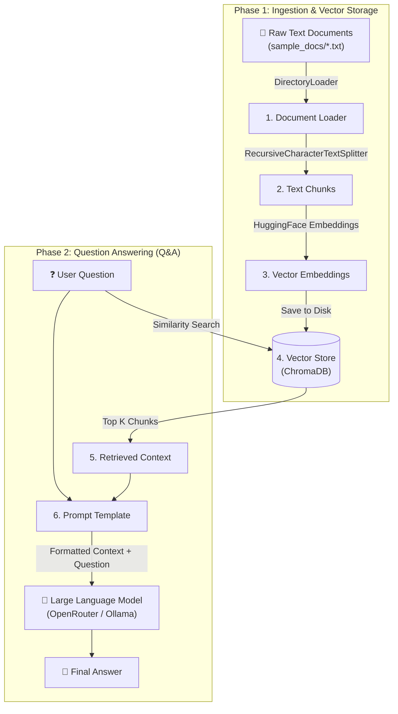

# Simple RAG Pipeline Architecture & Flow

This document explains the step-by-step workflow of the **Retrieval-Augmented Generation (RAG)** pipeline implemented in `rag_pipeline.py` and `qa_assistant.py`, based on core concepts from lessons 1–16 in the `langc` folder.

---

## 📊 Visual Flow Diagram



---

## 🔄 Detailed Pipeline Flow

### 1. Document Loading (`DirectoryLoader` & `TextLoader`)
* **Reference**: `13. documentload.py`
* Reads raw text files (`.txt`) from the `sample_docs/` folder into memory as `Document` objects containing raw text content and metadata.

### 2. Document Chunking (`RecursiveCharacterTextSplitter`)
* **Reference**: `14. textSplitter.py`
* Breaks large text files into smaller, overlapping chunks (e.g., chunk size 500 characters, overlap 50 characters).
* Chunking ensures that the retrieved context fits within the LLM's context window and preserves semantic meaning.

### 3. Text Embedding & Storage (`HuggingFaceEmbeddings` + `Chroma`)
* **Reference**: `15. embed.py` & `16. ingestion_1.py`
* Converts each text chunk into a high-dimensional vector representation using `sentence-transformers/all-MiniLM-L6-v2`.
* Stores these vector embeddings in Chroma DB (`db/chroma_db`) for fast similarity searches.

### 4. Similarity Search & Context Retrieval
* **Reference**: `retreive.py`
* When a user inputs a query, the assistant embeds the user question and performs a cosine similarity search against stored vectors in ChromaDB to retrieve the **Top-K most relevant chunks**.

### 5. Context-Guided Prompting & Answer Generation (`ChatOpenAI` / `ChatOllama`)
* **Reference**: `3. llm call.py`, `6. prompting.py`, & `10. chaining.py`
* Combines the retrieved document chunks (Context) and the User Question into a structured System Prompt.
* Passes the combined prompt to the LLM (`OpenRouter` / `Ollama`) to generate an accurate answer constrained strictly to the provided context.

---

## 🚀 How to Run

1. **Install Dependencies**:
   ```bash
   pip install -r requirements.txt
   ```

2. **Ingest Documents (Optional standalone test)**:
   ```bash
   python rag_pipeline.py
   ```

3. **Run Interactive Q&A Assistant**:
   ```bash
   python qa_assistant.py
   ```
